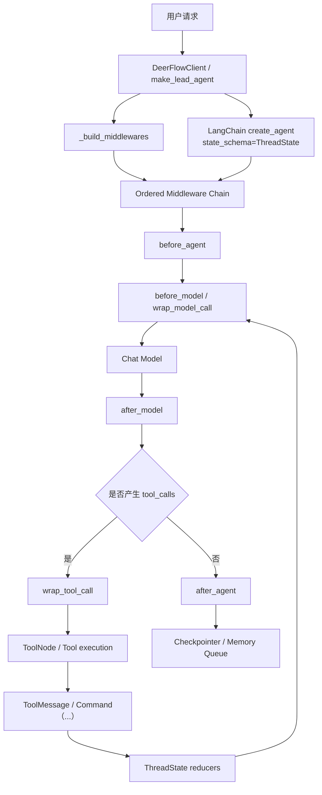

# DeerFlow 源码解读：Middleware System

## 1. 这套 Middleware System 在解决什么问题

在构建复杂的 Agent 系统时，我们经常会面临一个问题：核心的 LLM 推理循环应该保持纯粹，但业务上又需要处理诸如“工作目录创建、对话压缩、记忆注入、沙箱生命周期管理”等大量副作用。

DeerFlow 的解法是：**引入一套基于钩子（Hooks）的中间件（Middleware）流水线。** 这套系统将所有非核心推理的业务逻辑剥离，使得 Agent 的能力得到扩展。

Middleware System它主要解决五类问题：

1. 用户请求进入 agent 之前，线程目录、上传文件、沙箱上下文如何准备好
2. 模型调用之前，消息历史如何被修补、压缩、补充
3. 工具调用之前，是否允许执行、异常如何兜底、是否需要直接中断
4. 模型返回之后，标题、todo、图片、多子代理并发限制、循环检测如何追加控制
5. 整个 run 结束之后，哪些状态需要写回 `ThreadState`，哪些对话需要进入长期记忆

## 2. 架构总览

### 2.1 层级图

如果按 LangChain AgentMiddleware 的 hook 来分层，middleware可以整理成下面这张表：

1. **before_agent******
   1. `ThreadDataMiddleware`、`UploadsMiddleware`、`SandboxMiddleware`
   2. 准备线程运行时底座：计算 thread 目录、注入上传文件上下文、建立 sandbox 生命周期语义
2. wrap_model_call
   1. `DanglingToolCallMiddleware`、`DeferredToolFilterMiddleware`
   2. 直接改`ModelRequest`：修补 dangling tool call 历史、按需隐藏 deferred tool schema
3. before_model
   1. `SummarizationMiddleware`、`TodoMiddleware`、`ViewImageMiddleware`
   2. 在模型真正推理前整理上下文：压缩历史、补 todo reminder、把已查看图片重新注入消息
4. wrap_tool_call
   1. `GuardrailMiddleware`、`ToolErrorHandlingMiddleware`、`ClarificationMiddleware`
   2. 在工具真正执行前做治理：授权检查、异常兜底、追问中断
5. after_model
   1. `TokenUsageMiddleware`、`TitleMiddleware`、`SubagentLimitMiddleware`、`LoopDetectionMiddleware`
   2. 对模型输出做后处理：记录 token、生成标题、限制并发 subagent、截断循环调用
6. after_agent
   1. `SandboxMiddleware`、`MemoryMiddleware`
   2. 在整轮 run 收尾时处理生命周期：释放或回收 sandbox、把过滤后的对话送入 memory queue

有两个细节值得特别注意：

1. `SandboxMiddleware` 会同时出现在 `before_agent` 和 `after_agent` 两层，因为它负责的是生命周期，而不是单次消息改写。
2. `wrap_model_call`、`before_model`、`wrap_tool_call`、`after_model` 处在 agent 主循环内部，所以它们不是只跑一次，而是可能随着 tool loop 多次进入。

### 2.2 架构图



从这张图里可以看出，middleware 不是一个“边缘补丁层”，而是直接夹在 agent 主循环的关键位置上：

- model 前侧：改消息、改工具 schema、补上下文
- tool 前侧：授权、异常处理、追问中断
- model 后侧：截断错误行为、写入额外状态
- run 结束后：释放资源、异步记忆

### 2.3 当前源码里的实际链路

完整装配入口在：

- `backend/packages/harness/deerflow/agents/lead_agent/agent.py`
- `backend/packages/harness/deerflow/agents/middlewares/tool_error_handling_middleware.py`

按当前代码，lead agent 的 middleware 顺序如下：


| 顺序 | Middleware                     | 主要进入点                     | 是否条件插入 | 主要职责                                                   |
| ---- | ------------------------------ | ------------------------------ | ------------ | ---------------------------------------------------------- |
| 1    | `ThreadDataMiddleware`         | `before_agent`                 | 否           | 计算 thread 对应的`workspace/uploads/outputs` 路径         |
| 2    | `UploadsMiddleware`            | `before_agent`                 | 否           | 把上传文件转成`` 上下文并写回`messages` / `uploaded_files` |
| 3    | `SandboxMiddleware`            | `before_agent` / `after_agent` | 否           | 负责沙箱生命周期；默认是 lazy-init                         |
| 4    | `DanglingToolCallMiddleware`   | `wrap_model_call`              | 否           | 修补历史里缺失的`ToolMessage`                              |
| 5    | `GuardrailMiddleware`          | `wrap_tool_call`               | 是           | 工具调用前授权检查                                         |
| 6    | `ToolErrorHandlingMiddleware`  | `wrap_tool_call`               | 否           | 把工具异常转成`ToolMessage(status="error")`                |
| 7    | `SummarizationMiddleware`      | `before_model`                 | 是           | 上下文接近阈值时压缩历史                                   |
| 8    | `TodoMiddleware`               | `before_model`                 | 是           | 计划模式下维持 todo 上下文可见                             |
| 9    | `TokenUsageMiddleware`         | `after_model`                  | 是           | 记录 token 使用量                                          |
| 10   | `TitleMiddleware`              | `after_model`                  | 否           | 首轮完整对话后自动生成标题                                 |
| 11   | `MemoryMiddleware`             | `after_agent`                  | 否           | 把过滤后的对话入队到长期记忆                               |
| 12   | `ViewImageMiddleware`          | `before_model`                 | 是           | 把已查看图片重新注入给支持视觉的模型                       |
| 13   | `DeferredToolFilterMiddleware` | `wrap_model_call`              | 是           | 开启`tool_search` 时隐藏延迟工具 schema                    |
| 14   | `SubagentLimitMiddleware`      | `after_model`                  | 是           | 截断同一轮里过多的`task` 调用                              |
| 15   | `LoopDetectionMiddleware`      | `after_model`                  | 否           | 检测重复 tool call loop                                    |
| 16   | `ClarificationMiddleware`      | `wrap_tool_call`               | 否           | 拦截`ask_clarification` 并返回 `Command(goto=END)`         |

## 3. 源码解析

### 3.1 装配入口：`make_lead_agent()` 并不自己写逻辑，而是组装一条链

最值得先看的函数是：

- `backend/packages/harness/deerflow/agents/lead_agent/agent.py` 里的 `_build_middlewares(...)`

它的核心思路不是写一个巨大的 if/else，而是分两段装配：

1. `build_lead_runtime_middlewares(...)` 先构建运行时基础链
   这一段负责 `ThreadData`、`Uploads`、`Sandbox`、`DanglingToolCall`、`Guardrail`、`ToolErrorHandling`
2. `_build_middlewares(...)` 再按运行模式和模型能力，继续 append lead-agent 专属中间件
   例如 `Summarization`、`Todo`、`Title`、`Memory`、`ViewImage`、`SubagentLimit`、`LoopDetection`、`Clarification`

最后 `make_lead_agent(...)` 把这条链直接交给：

```python
create_agent(
    model=...,
    tools=...,
    middleware=_build_middlewares(...),
    system_prompt=...,
    state_schema=ThreadState,
)
```

这一步非常关键。
它说明 middleware 不是 DeerFlow 自己发明的一套私有机制，而是直接建立在 LangChain `create_agent(...)` 的 middleware API 之上，只不过 DeerFlow 把它工程化、系统化了。

### 3.2 运行时底座层：先把 thread 的执行世界搭出来

这一层最容易被误解，因为很多文章会把它写成“先创建目录，再获取沙箱”。
源码里的真实情况更细一点。

#### 3.2.1 `ThreadDataMiddleware`

对应文件：

- `backend/packages/harness/deerflow/agents/middlewares/thread_data_middleware.py`

它在 `before_agent` 里做的事情是：

1. 从 `runtime.context` 或 `config.configurable` 里取 `thread_id`
2. 计算该 thread 的三个路径：
   - `workspace_path`
   - `uploads_path`
   - `outputs_path`
3. 把这些路径写进 `state["thread_data"]`

一个很容易忽略的细节是：当前 lead agent 用的是 `lazy_init=True`。
这意味着默认情况下它**先计算路径，不急着真正创建目录**。真正的目录创建，会在沙箱工具第一次执行时由 `ensure_thread_directories_exist(...)` 懒触发。

这就是 DeerFlow 的第一个设计巧思：**先把“路径契约”放进 state，再把真正昂贵或有副作用的初始化延迟到首次使用。**

#### 3.2.2 `UploadsMiddleware`

对应文件：

- `backend/packages/harness/deerflow/agents/middlewares/uploads_middleware.py`

它在 `before_agent` 里干了两件事：

1. 从最后一条 `HumanMessage.additional_kwargs.files` 中提取本轮新上传的文件
2. 扫描 thread 对应的 uploads 目录，补出历史上传文件

然后它会构造一个 `<uploaded_files>...</uploaded_files>` 文本块，**直接前置插入到最后一条用户消息前面**，同时还把结构化文件信息写进 `uploaded_files`。

这样做的好处是：

- 模型能立刻知道“有哪些文件可读、路径是什么”
- 前端仍然保留结构化 `additional_kwargs.files`
- Memory middleware 之后还可以把这个上传块剥离掉，避免把线程级临时路径写进长期记忆

这是一种很典型的“消息层 + 状态层双写”设计。

#### 3.2.3 `SandboxMiddleware`

对应文件：

- `backend/packages/harness/deerflow/sandbox/middleware.py`
- `backend/packages/harness/deerflow/sandbox/tools.py`

如果只看 `SandboxMiddleware` 的类名，你会以为它在 `before_agent` 里就拿好了 sandbox。但当前 lead agent 实际传入的是 `SandboxMiddleware(lazy_init=True)`，所以默认行为是：

- `before_agent` 不急着 acquire sandbox
- 真正首次调用 `bash` / `ls` / `read_file` / `write_file` 等 sandbox tool 时，`ensure_sandbox_initialized(...)` 才去 acquire

这说明 DeerFlow 对沙箱的建模并不是“请求一进来就开容器”，而是：

- 先在 middleware 层建立 thread 和 sandbox 的关联语义
- 再在 tool runtime 层做真正的延迟初始化

这里再往下看 provider，会发现 `release(...)` 语义也不是“一刀切销毁”：

- `LocalSandboxProvider.release(...)` 基本是 no-op，保留单例
- `AioSandboxProvider.release(...)` 会把 sandbox 放进 warm pool，而不是立刻销毁容器

这意味着 DeerFlow 追求的不是“每轮都新建一套隔离环境”，而是 **线程级复用 + 成本可控的懒初始化**。

### 3.3 model 前：修历史、压上下文、补多模态

这一层说明了一个重要事实：DeerFlow 的 middleware 不是只管状态，还直接管模型看到的请求内容。

#### 3.3.1 `DanglingToolCallMiddleware`

对应文件：

- `backend/packages/harness/deerflow/agents/middlewares/dangling_tool_call_middleware.py`

它解决的是一个非常真实的 agent runtime 问题：

- 历史里某条 `AIMessage` 发起了 tool call
- 但由于用户中断、请求取消等原因，后面的 `ToolMessage` 没有落下来
- 下一次再把这段历史送给模型时，message 序列就不完整了

DeerFlow 的做法不是简单忽略，而是补一条 synthetic `ToolMessage(status="error")`。

更巧的是，它没有放在 `before_model`，而是放在 `wrap_model_call`。原因源码里写得很直白：

- 如果用 `before_model` 再配合 `add_messages` reducer，补丁会被追加到消息尾部
- 但这里需要的是“紧跟在出问题的那条 `AIMessage` 后面”

所以 `wrap_model_call` 的价值不只是“包一层函数”，而是允许 DeerFlow 直接改 `ModelRequest.messages` 的局部顺序。

#### 3.3.2 `SummarizationMiddleware` + `TodoMiddleware`

对应文件：

- `backend/packages/harness/deerflow/agents/lead_agent/agent.py`
- `backend/packages/harness/deerflow/agents/middlewares/todo_middleware.py`

`SummarizationMiddleware` 是 LangChain 官方预置能力，DeerFlow 按配置创建后插入链中。
它的目标是：在上下文接近 token 阈值时，压缩历史，避免模型上下文爆炸。

但 DeerFlow 并没有把“上下文压缩”看成一件独立完成的事。它紧接着又实现了一个自定义 `TodoMiddleware`，继承 LangChain 的 `TodoListMiddleware`，专门处理一个非常隐蔽的问题：

- `write_todos` 的原始 tool call 和 ToolMessage 可能在 summarization 后被裁掉
- 但 `state["todos"]` 其实还在
- 模型这时会“失忆”，忘了自己还有 todo list

于是 `TodoMiddleware.before_model(...)` 会检测：

- state 里还有 todos
- 但消息窗口里已经看不到 `write_todos`

如果命中，它就注入一条 `HumanMessage(name="todo_reminder")`，把当前 todo 列表重新提醒给模型。

这是一种很漂亮的“message window 会丢，state 不会丢，所以用 state 回补 message”的设计。

#### 3.3.3 `ViewImageMiddleware`

对应文件：

- `backend/packages/harness/deerflow/agents/middlewares/view_image_middleware.py`

它解决的问题也很典型：

- `view_image` tool 已经把图片读出来了
- 图片 base64 已经写进 `state["viewed_images"]`
- 但如果不重新注回消息，模型其实“看不见”这张图

于是 `ViewImageMiddleware` 会在 `before_model` 里检查：

1. 最后一条 AIMessage 里是否发起过 `view_image`
2. 对应的 ToolMessage 是否都已经回来
3. 是否已经注入过图片详情消息

如果满足，就构造一条新的 `HumanMessage`，里面同时包含：

- 文本描述块
- `image_url` 数据块

这样多模态模型就能在下一次 model call 里真正“看到”图片。

这背后的核心思想是：**tool 不直接把多模态结果塞回模型，而是先写 state，再由 middleware 在合适时机把 state 重新翻译成消息。**

#### 3.3.4 `DeferredToolFilterMiddleware`

对应文件：

- `backend/packages/harness/deerflow/agents/middlewares/deferred_tool_filter_middleware.py`

这是当前 DeerFlow middleware 里非常容易被忽略，但其实非常工程化的一层。

场景是：

- MCP server 可能暴露几十个甚至更多工具
- 如果把所有 schema 一次性 `bind_tools` 给模型，上下文会很重，模型也更容易选错

于是 DeerFlow 采用了两层结构：

1. 工具仍然保留在执行侧注册表里，`ToolNode` 依然能执行
2. 但在 `wrap_model_call` 里把 deferred tool 从 `request.tools` 里过滤掉

模型只先看到“活跃工具”，而真正的大量工具通过 `tool_search` 再按需发现。

这实际上把“能执行什么工具”和“当前要暴露什么 schema”拆成了两件事。

### 3.4 tool 前：把工具调用变成可治理的受控动作

#### 3.4.1 `GuardrailMiddleware`

对应文件：

- `backend/packages/harness/deerflow/guardrails/middleware.py`

它是一个典型的 `wrap_tool_call` 中间件：

1. 把当前 tool call 组装成 `GuardrailRequest`
2. 交给 provider 判定是否允许
3. 如果拒绝，就返回一条 `ToolMessage(status="error")`
4. 如果 provider 自己报错，则根据 `fail_closed` 决定放行还是阻断

这里有个很关键的 LangGraph 兼容细节：
它显式放过 `GraphBubbleUp`，避免把 LangGraph 的控制流信号误当成普通异常吃掉。

这意味着 DeerFlow 的工具治理不是“看到异常就兜底”，而是 **区分业务异常和框架级控制流异常**。

#### 3.4.2 `ToolErrorHandlingMiddleware`

对应文件：

- `backend/packages/harness/deerflow/agents/middlewares/tool_error_handling_middleware.py`

这个 middleware 的设计非常实用：

- 它不是让一次 tool exception 直接炸掉整轮 run
- 而是把异常转成一条 `ToolMessage(status="error")`
- 再把这条错误信息交还给模型，让模型自己决定“换工具、降级、还是基于已有上下文继续”

从 agent 运行时视角看，这比直接抛异常更强：

- conversation history 仍然是完整的
- 下一轮 reasoning 仍然能看到失败原因
- agent 可以把失败当成正常观测信号的一部分

#### 3.4.3 `ClarificationMiddleware`

对应文件：

- `backend/packages/harness/deerflow/agents/middlewares/clarification_middleware.py`

这是 DeerFlow middleware 链里最像“控制流节点”的一个。

当模型调用 `ask_clarification` 时，它不会真的去执行一个外部工具，而是：

1. 读取 `question / context / options`
2. 生成一条给用户展示的 `ToolMessage`
3. 返回：

```python
Command(
    update={"messages": [tool_message]},
    goto=END,
)
```

它的意义不只是“追问用户”，而是把“追问”从普通 tool call 升级成了 **LangGraph 图级别的跳转语义**：

- `update=...` 负责把追问内容写进状态
- `goto=END` 负责尽快结束当前执行路径，把控制权交回用户

这也是为什么 Clarification 必须放在链尾的原因之一：
DeerFlow 希望它成为工具阶段里最末端、最确定的中断语义，而不是被后置 middleware 改写掉。

### 3.5 model 后与 run 收尾：把结果变成可持续运行的系统行为

#### 3.5.1 `TitleMiddleware`

对应文件：

- `backend/packages/harness/deerflow/agents/middlewares/title_middleware.py`

它在 `after_model` 里检查：

- title 功能是否开启
- 当前 thread 是否还没有 title
- 是否已经有“一次完整交换”（至少一个 human + 一个 ai）

满足后，就单独调一个 title model 生成标题，并写进 `state["title"]`。

这里的设计很稳：

- 不是每轮都生成
- 失败时有 fallback
- 会先把结构化 content 归一化成纯文本

它本质上是在做“消息内容 -> UI 元数据”的派生计算。

#### 3.5.2 `SubagentLimitMiddleware`

对应文件：

- `backend/packages/harness/deerflow/agents/middlewares/subagent_limit_middleware.py`

这层不是靠 prompt 约束，而是靠 runtime 强制收口：

- 如果模型一次性吐出过多 `task` 调用
- middleware 会直接截断，只保留前 `max_concurrent`

这说明 DeerFlow 在子代理调度上采用的是 **prompt 约束 + runtime 硬限制** 双保险，而不是只相信模型“会自觉”。

#### 3.5.3 `LoopDetectionMiddleware`

对应文件：

- `backend/packages/harness/deerflow/agents/middlewares/loop_detection_middleware.py`

这层的思路也很工程化：

1. 对一组 tool calls 做确定性 hash
2. 以 thread 为粒度维护滑动窗口
3. 连续重复到阈值时，先注入 warning
4. 超过 hard limit 时，直接把最后一条 AIMessage 的 `tool_calls` 清空，逼模型输出最终文本答复

尤其妙的一点是：它注入的是 `HumanMessage`，而不是 `SystemMessage`。
源码里明确写了原因：为了避开 Anthropic 对“中途插入非连续 system message”的限制。

这说明 DeerFlow 的 middleware 设计已经不是抽象层面的“理论优雅”，而是把不同 provider 的真实约束都考虑进去了。

#### 3.5.4 `MemoryMiddleware`

对应文件：

- `backend/packages/harness/deerflow/agents/middlewares/memory_middleware.py`

它挂在 `after_agent`，也就是整个 run 收尾阶段。

它不会把所有消息都丢给长期记忆，而是先过滤：

- 去掉 tool message
- 去掉带 `tool_calls` 的中间 AIMessage
- 去掉 `<uploaded_files>` 这种线程级临时注入块

只保留：

- 用户真正说过的话
- 最终 assistant 回复

然后再异步入队给 memory 系统。

这一步很重要，因为如果没有这层过滤，长期记忆会迅速被：

- 临时文件路径
- 中间推理步骤
- 工具异常噪音

污染掉。

## 4. 设计巧妙之处

把整条链读完后，DeerFlow middleware 最巧的地方主要有下面几个。

### 4.1 不是“统一 hook”，而是“问题和 hook 对齐”

DeerFlow 没有把所有能力都堆到 `before_model` 里，而是根据问题本质选 hook：

- 路径和上传文件属于 `before_agent`
- 改模型请求属于 `wrap_model_call`
- 工具治理属于 `wrap_tool_call`
- 标题、循环控制属于 `after_model`
- 记忆更新属于 `after_agent`

这让每一层都很薄，也很容易单独推理。

### 4.2 先写 state，再把 state 翻译回 message

`ThreadState` 是这整套设计的“细腰”：

- tool 先把副作用写进 state
- middleware 再决定是否把 state 重新转成消息

`ViewImageMiddleware` 和 `TodoMiddleware` 都是这个思路的典型例子。
这比直接在工具里乱改对话历史更可控。

### 4.3 修复消息历史时，连“插入位置”都精确控制

`DanglingToolCallMiddleware` 之所以用 `wrap_model_call` 而不是 `before_model`，就是因为 DeerFlow 不只想“补一条消息”，还想保证它插在正确位置。

这看起来像小细节，但在 agent runtime 里非常关键：
message 顺序一乱，模型就会读到伪造因果关系。

### 4.4 工具失败不直接炸 run，而是回到语言层继续推理

`ToolErrorHandlingMiddleware` 把异常转成 `ToolMessage`，本质上是在做：

- “异常” -> “模型可理解的观察结果”

这让 agent 能在失败后继续恢复，而不是每次都交给外层调用方重试。

### 4.5 追问不是普通工具，而是图控制流

`ClarificationMiddleware` 把 `ask_clarification` 提升成 `Command(goto=END)`，这非常像把“追问用户”变成了 LangGraph 图里的一个终止分支。

换句话说，DeerFlow 不是在 prompt 里要求模型“必要时追问”，而是在 runtime 层给了它一个正式的中断出口。

### 4.6 延迟初始化让“准备环境”不等于“立刻付成本”

`ThreadDataMiddleware` 和 `SandboxMiddleware` 都支持 lazy init：

- 路径先算出来
- sandbox 先建立契约
- 真正有副作用的目录创建 / sandbox acquire 等到首次工具执行时再做

这让“安全地准备好环境”和“每轮都立刻付出初始化成本”被拆开了。

### 4.7 新增能力时，通常不需要改 agent 主体

这也是 middleware 架构最值钱的地方。

新增能力时，很多时候只需要：

1. 写一个新的 middleware
2. 选择正确的 hook
3. 插到正确的位置

在 `create_deerflow_agent(...)` 这条线里，甚至还支持 `extra_middleware` + `@Next/@Prev` 锚点插入。
这意味着 DeerFlow 把“扩展 agent 行为”设计成了一等公民，而不是只能改大而全的 agent 主函数。

## 5. 涉及到的 LangChain / LangGraph 相关知识

这一节可以把 DeerFlow middleware 背后的框架知识压成四个关键点。

### 5.1 `create_agent(...)` 的 middleware 能力

DeerFlow 的 lead agent 最终也是走：

- `langchain.agents.create_agent(...)`

官方 middleware 文档强调，middleware 的目标就是在 agent loop 的关键步骤前后插手：

- model call 前后
- tool call 前后
- run 开始和结束

DeerFlow 基本就是沿着这套官方接口，把业务逻辑工程化了一遍。

### 5.2 `AgentState` / `ThreadState` 与 reducer

DeerFlow 的 `ThreadState` 继承自 `AgentState`，并用 `Annotated[..., reducer]` 给部分字段声明合并策略：

- `artifacts` 用 `merge_artifacts`
- `viewed_images` 用 `merge_viewed_images`

这正是 LangGraph state graph 的核心思想：

- state 不是普通 dict
- 它是一个可在节点、工具、middleware 之间持续合并的共享状态面

也正因为有 reducer，多个环节才能安全地一起写同一个字段，而不是互相覆盖。

### 5.3 `AIMessage`、`ToolMessage`、`HumanMessage`

DeerFlow middleware 里频繁操作三类消息：

- `HumanMessage`：用户消息，或系统伪装成用户注入的提醒
- `AIMessage`：模型输出，可能带 `tool_calls`
- `ToolMessage`：工具返回结果，负责闭合某个 tool call

很多 middleware 的本质其实就是在维护这三者的合法关系：

- `DanglingToolCallMiddleware` 修补 `AIMessage -> ToolMessage` 配对
- `UploadsMiddleware` 改写 `HumanMessage`
- `LoopDetectionMiddleware` 注入额外 `HumanMessage`
- `ClarificationMiddleware` 人工构造 `ToolMessage`

### 5.4 `Command(update=..., goto=...)` 是 LangGraph 的控制流能力

`ClarificationMiddleware` 用到的：

```python
Command(update=..., goto=END)
```

背后是 LangGraph 的一个核心概念：

- `update`：本次节点执行对 state 的增量更新
- `goto`：下一步跳到哪里

所以 `Command` 不只是“返回点数据”，而是把“更新状态”和“改变图走向”放在同一个返回值里。

这也是为什么 DeerFlow 能把“ask_clarification”做成一个真正的中断动作，而不是只返回一段普通文本。

### 5.5 `ToolNode` / `ToolCallRequest` 与 tool middleware

在 LangChain / LangGraph agent loop 里，模型先产出带 `tool_calls` 的 `AIMessage`，然后工具执行层再把这些调用路由到真实工具。

DeerFlow 的 `GuardrailMiddleware`、`ToolErrorHandlingMiddleware`、`ClarificationMiddleware` 都是在这个阶段，通过 `ToolCallRequest` 进行拦截。

因此它们并不是“包裹工具函数本身”，而是在更高一层的 runtime 里统一治理工具调用。
