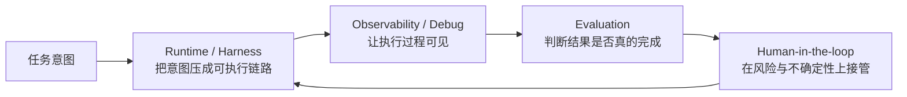
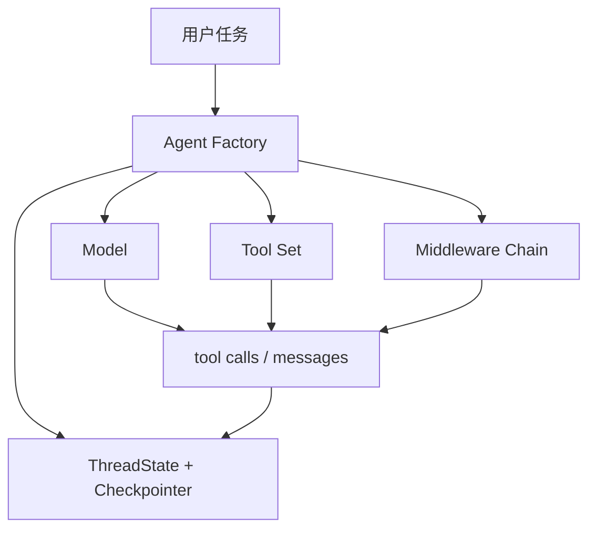
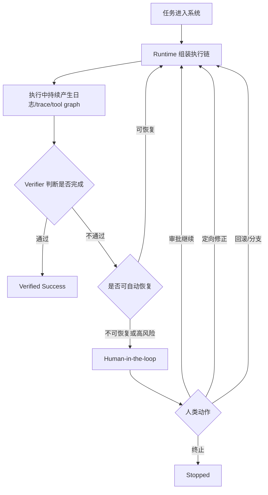

# DeerFlow Research Agent 总览

> 用 Runtime、Observability、Evaluation、Human-in-the-loop 四层视角理解一个成熟 agent 系统

当 Agent 不再只是回答单个问题，而是真正进入复杂、长期、带约束的工作流时，一个可被信任的执行系统应该如何成立，DeerFlow 已经具备了哪些基础，又还缺哪些关键层。

## 1. 四层视角为什么有用

当 Agent 进入复杂工作流后，系统可靠性来自四种不同能力：

| 层                    | 核心问题           | 没有这一层会发生什么                       |
| --------------------- | ------------------ | ------------------------------------------ |
| Runtime / Harness     | 任务到底怎么跑起来 | 系统停留在“建议”而不是“执行”               |
| Observability / Debug | 失败到底发生在哪   | 系统会失败，但没人知道为什么               |
| Evaluation            | 任务到底算不算完成 | agent 自称成功，系统却无法证明             |
| Human-in-the-loop     | 人类何时、如何接管 | 高风险任务里要么过度自动化，要么完全不可控 |

因此，一个成熟可用的 agent 系统，核心目标不再是提升单轮回答质量，而是建立一条**可信执行链**：

## 2. 四层视角下的DeerFlow

- Runtime / Harness 主体已经很清楚
- Observability / Debug 有基础能力，但还没有形成完整调试产品
- Evaluation 还更像未来应补齐的制度层
- Human-in-the-loop 已经有中断与澄清机制，但离“审批、回滚、分支、恢复”的完整操作面还有距离

## 3. Runtime / Harness：把“一个想法”压成可执行链路

### 3.1 这一层真正解决的问题

Runtime / Harness 层不是在解决“模型怎么更聪明”，而是在解决“任务怎么真正跑起来”。

一个成熟系统在这一层需要明确回答：

- 任务状态存在哪里，如何跨轮持久化
- 工具调用如何被包装成统一执行单元
- 执行预算如何被约束，而不是无限递归、无限试错
- 输出如何结构化，而不是只返回一段自然语言
- 从“用户意图”到“可执行图”的这条链路，到底由什么机制承载

### 3.2 DeerFlow 的思路

DeerFlow 在这一层的核心取向很明确：**它把模型放进一个带状态、带工具、带 middleware 的运行时里。**

从实现落点上看，这一层主要由下面几部分组成：

- `make_lead_agent(...)` / `create_deerflow_agent(...)`：负责装配 agent 运行图
- `ThreadState`：把消息、产物、sandbox、viewed_images、todos 等状态放入统一 state
- `checkpointer`：为跨轮延续和持久化提供基础
- Tool System：把内置工具、配置工具、MCP 工具、ACP agent 统一成可调度能力
- Middleware 链：负责在 model call 和 tool call 两侧做控制、修补和约束

这意味着 DeerFlow 的 runtime 不是“prompt + tool list”，而更像：

### 3.3 为什么这一层是可信执行的底座

可信执行首先要求“执行”本身是一个被系统接住的对象，而不是一次性的文本生成。

DeerFlow 在这方面已经体现出几个非常重要的原则：

- **状态显式化**：任务不只是一串消息，还有 `artifacts`、`viewed_images`、`thread_data`、`title` 等结构化状态
- **工具统一化**：文件操作、web、子代理、外部 ACP agent 都被统一放进 tool abstraction
- **副作用受控**：工具可以通过 `Command(update=...)` 回写 state，而不是偷偷改外部环境
- **预算意识**：已有 `SubagentLimitMiddleware`、token usage logging、超时和 polling 限制等预算控制雏形
- **中断能力**：系统允许在执行中途停下来，而不是必须把一轮对话跑到底

### 3.4 这一层还缺什么

如果按照“成熟执行系统”的标准继续往前推，这一层未来还应补齐：

- 更清晰的 task lifecycle 模型：pending / running / blocked / verified / failed / abandoned
- 更显式的 budget model：token、时间、工具调用次数、风险预算统一纳管
- 更强的结果契约：不仅有自然语言答复，也有 machine-readable outcome
- 更原生的 branch / replay / rollback runtime 支持

这里的判断是方法论上的推论：DeerFlow 已经具备了 runtime 基础，但还没有把“执行状态机”抽象。

## 4. Observability / Debug：让失败变得可追踪、可解释、可修复

### 4.1 这一层不是“多打点日志”而已

Agent 系统的失败往往不是单点故障，而是链式故障：

- 任务分解错了
- 选错工具了
- 工具参数错了
- 结果写回 state 时丢了
- 中途被中断后历史格式损坏
- 子代理成功了，但主代理误解了返回值

所以 Observability / Debug 层的目标不是收集更多日志，而是回答：

- 这次 run 到底做了什么
- 它为什么走到这一步
- 错误发生在哪一层
- 这次失败与上次失败是不是同一种
- 换一个 runtime / prompt / tool policy 后，行为到底发生了什么变化

### 4.2 DeerFlow 已有的基础能力

DeerFlow 在这层已经有一些扎实的底座：

- 普通 logging：几乎所有 runtime 组件都有明确日志
- `trace_id`：`task_tool` 在子代理链路里显式传递 trace 标识
- LangSmith tracing：模型工厂会尝试挂接 tracer
- `runs.stream` / `runs.wait`：让执行过程既能最终收敛，也能实时观察
- `TokenUsageMiddleware`：把 token 消耗纳入观测面
- 中间件化故障修补：如 `DanglingToolCallMiddleware`、`ToolErrorHandlingMiddleware`

### 4.3 一个成熟系统还需要哪些调试能力

如果以更高标准看，一个成熟 agent debug system 还需要至少五种视图：

1. **Run Trace**：一轮任务的完整执行轨迹
2. **Tool-call Graph**：工具调用依赖图，而不只是线性日志
3. **Failure Taxonomy**：把失败分为 planner failure、tool failure、policy failure、verification failure、human-blocked 等
4. **Run Diff**：比较两个版本的 agent 在同一任务上的行为差异
5. **Replay / Reproduction**：允许开发者用固定输入、固定上下文重放失败路径

从这个角度看，DeerFlow 当前更接近“具备 observability primitives”，但还没有形成一套完整的 agent debugging surface。

### 4.4 为什么这层对 research agent 尤其重要

research agent 的任务通常更长、更多跳转、更多外部依赖，因此它的失败不是“答错一句话”，而是“花了 15 分钟走错了一条任务路径”。如果没有 observability：

- 你根本不知道 agent 是笨，还是 runtime 有 bug
- 你无法比较不同方案的恢复能力
- 你无法在失败后沉淀可靠的改进策略

也因此，Observability / Debug 不应该被看作 DevOps 附件，而应被看作 **agent reliability 的核心组成部分**。

## 5. Evaluation：把“自称完成”与“真正完成”区分开

### 5.1 这是最容易缺失、也最关键的一层

很多 agent 系统在 Runtime 和 Tooling 上做得很强，却仍然不可靠，原因往往不是“不会执行”，而是 **不会判断自己是否真的完成了任务**。

一个成熟的 Evaluation 层至少要解决四个问题：

- 什么叫任务完成
- 谁来判断完成
- 如果 agent 说完成了，但 verifier 不认可，该怎么处理
- 如何稳定比较两种 agent 方案在可靠性、成本和恢复能力上的差异

### 5.2 为什么不能只信 agent 自报成功

在复杂任务里，agent 的“完成”通常只是 self-reported success：

- “我已经改好了”
- “测试应该通过了”
- “文件已经生成”
- “研究已经完成”

这些陈述在没有外部 verifier 时，都不应该被当成真实完成。

一个更可信的系统会把成功拆成至少两个层次：

- **Self-reported success**：agent 自己认为完成了
- **Verified success**：外部验证器确认产物满足要求

这意味着 Evaluation 层的职责不是生成分数，而是 **把成功的定义从语言陈述升级为系统判定**。

### 5.3 DeerFlow 当前的状态

从仓库现状看，DeerFlow 已经有一些通往 evaluation 的前置条件：

- runtime 有结构化 state
- artifacts 可以被明确产出与交付
- checkpointer 能保留执行上下文
- tool / middleware 层允许引入 verifier 或 guardrail

但如果严格说，它目前还没有一个仓库内成体系的 Evaluation 层，例如：

- 专门的 task suite
- verifier framework
- self-report vs verified outcome 的分离记录
- run-level metrics 仪表
- 方案对比基准

这里的判断是基于当前代码与文档结构做出的推论：**Evaluation 在 DeerFlow 更像下一阶段应显式建设的层，而不是当前已经成型的系统。**

### 5.4 一个成熟 Evaluation 层应该长什么样

一个更完整的设计原型会包含：

1. **任务集**：覆盖研究、文件操作、工具协作、长链任务恢复等典型场景
2. **Outcome Schema**：成功、部分成功、失败、超时、人工接管、验证失败
3. **External Verifier**：例如文件是否存在、结构是否正确、测试是否通过、引用是否满足约束
4. **Cost & Recovery Metrics**：不仅比较成功率，还比较 token、时间、工具调用数、失败后恢复轮数
5. **A/B Comparison Harness**：比较不同模型、不同 middleware、不同 tool policy 的行为

对 research agent 来说，真正重要的指标往往不是“第一次就成功”，而是：

- 在受限预算下的成功率
- 在失败后的恢复能力
- 在高风险任务上的保守性
- 在需要人接管时的上下文保持能力

## 6. Human-in-the-loop：让人类在关键处介入，而不是事后收尸

### 6.1 人类不应该只在最后看结果

很多系统把人类角色理解成“最终 reviewer”。这太晚了。

对一个长期执行 agent 来说，人类应该能在多个时刻介入：

- 目标本身不清楚时
- 风险操作即将发生时
- verifier 判断失败但 agent 想继续尝试时
- 成本、时间或风险预算即将超标时
- 系统进入异常循环或低置信状态时

Human-in-the-loop 的重点不是削弱自动化，而是把人放在 **高价值决策点** 上。

### 6.2 DeerFlow 已有的能力

DeerFlow 在这一层已经有几个很关键的落点：

- `ask_clarification` + `ClarificationMiddleware`：允许 agent 主动中断并向用户提问
- channel / streaming 机制：允许在运行过程中持续看到状态变化
- checkpointer：为“人接手后继续执行”提供上下文延续基础
- Guardrails 文档与中间件思路：把“全部依赖人审批”推进到“策略 + 人工协同”的方向

尤其 `ClarificationMiddleware` 很重要，因为它代表了一种系统立场：

> 当信息不足时，正确行为不是胡乱继续，而是把执行权显式交还给人。

这已经不是普通聊天产品的逻辑，而是执行系统的逻辑。

### 6.3 一个成熟的人机协同层还应补什么

如果进一步上强度，一个成熟 HITL 层通常还应支持：

- **审批节点**：允许对特定 tool / capability / risk class 做批准
- **定向反馈**：不是“再试一次”，而是“保留这部分，修改那部分”
- **Rollback / Branch**：允许从某一步分叉，而不是只能整条重跑
- **Operator View**：给人工接管者看到当前 state、最近动作、失败原因、待决策事项
- **Resume Protocol**：人在介入后，系统能带着上下文恢复，而不是从头开始

从这个标准看，DeerFlow 已经拥有中断与恢复的基础，但还没有把 operator workflow 做成完整的一等能力。

## 7. 把四层组合起来：一个更完整的系统原型

如果把上面四层组合起来，一个成熟 research agent system 的工作方式更像这样：

这个原型背后的核心思想是：

- Runtime 负责让任务真正动起来
- Observability 负责让系统知道自己刚刚做了什么
- Evaluation 负责判断这件事到底算不算完成
- HITL 负责在不确定与高风险区域里接管控制权

只有这四层合在一起，Agent 才会从“能做点事”变成“可被组织信任地承担任务”。

## 8. 结语

DeerFlow 已经具备了一个 research agent system 的骨架，尤其在 Runtime / Harness 层和可中断执行层面有较清晰的工程形态；而它未来真正决定上限的，不只是更多工具或更强模型，而是能否把 Observability、Evaluation 和 Human-in-the-loop 补成一个闭环。

因此，这篇总览真正想回答的问题不是“DeerFlow 有哪些模块”，而是：当 Agent 进入复杂、长期、带约束的真实工作流时，系统必须从“会回答”升级为“可执行、可观测、可验证、可接管”。DeerFlow 的价值，正在于它已经站上了这条演化路径。
