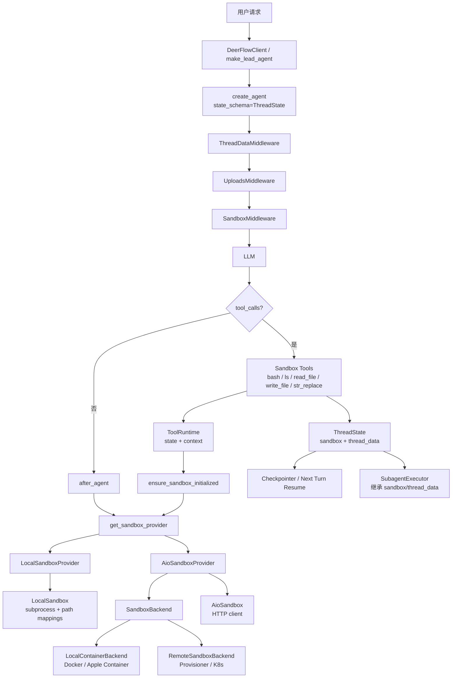
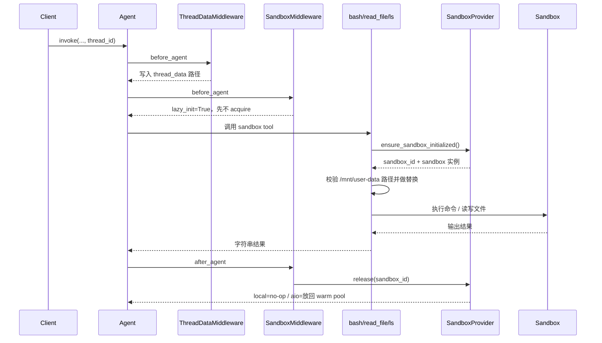

# DeerFlow 源码解读：Sandbox System

## 1. 这套 Sandbox System有什么不同？

DeerFlow 2.0 的 sandbox 不是一个临时的“代码执行工具”，而是 agent 运行时的一部分。sandbox 是通过 `SandboxMiddleware` 在 agent 生命周期里先 `acquire()`、结束后再 `release()` 的；同时它被写进 `ThreadState`，和 thread 的 workspace、uploads、outputs 一起管理。这意味着它更像“每个线程自带一台受控的小电脑”，而不是“模型偶尔调用一次代码解释器”。

与其他agent的sandbox system差异拆成四层：

- 第一层是“运行时位置”。很多 agent 的 sandbox 本质上是一个工具：需要时开个 Python/bash 执行器，执行完返回文本结果。DeerFlow 不是这个思路。它先建立线程级执行环境，再让文件读写、目录遍历、bash、产物输出都围绕这个环境展开。所以它更适合长链路任务，尤其是会反复读文件、改文件、生成产物的任务。这个差异是架构位次上的差异，不只是工具列表多了一个 `bash`。

- 第二层是“文件系统模型”。DeerFlow 明确定义了虚拟路径系统：agent 看到的是 `/mnt/user-data/workspace`、`/mnt/user-data/uploads`、`/mnt/user-data/outputs`，以及 `/mnt/skills`；底层再把这些路径翻译到真实物理目录。并且它是按 thread 隔离目录的，不同 thread 各有自己的 workspace / uploads / outputs。这和很多 agent 只有一个临时工作目录，或者直接在宿主机项目目录上操作，差别很大。

- 第三层是“可替换的 sandbox 后端”。DeerFlow 不是只支持一种模式。它把 sandbox 抽象成统一接口，然后允许切换 Local、Docker AIO、Kubernetes Provisioner 三种模式。也就是说，它从一开始就把 sandbox 当成可部署、可替换、可扩展的 runtime substrate，而不是写死在某个“本地 shell”或“单容器”实现里。很多 agent 也能接容器，但 DeerFlow 这里是官方一等公民设计，而不是外围适配。

- 第四层是“安全模型拆分”。这点很关键。DeerFlow 文档明确说：LocalSandboxProvider 只是 host-side convenience mode，不是可靠的 shell 隔离边界，所以默认禁用 host bash；要更安全的 bash，应该用 AioSandboxProvider。它还单独引入 Guardrails，把“进程隔离”和“语义授权”分开：即便在 sandbox 里，`bash` 仍然可能 `curl` 外传数据，所以还需要对每一次 tool call 做策略判断。很多 agent 会把“我在容器里跑了”近似等同于“安全了”，DeerFlow 至少在设计文档里没有混淆这两件事。

所以，DeerFlow 2.0 的 sandbox真正不同的地方在于：

1. 它是线程级 runtime，不是一次性工具调用。
2. 它有稳定的虚拟文件系统和 thread 目录模型。
3. 它把 Local / Docker / K8s 都抽象成同一个 sandbox provider 体系。
4. 它把 sandbox、artifacts、uploads、skills、guardrails 放进同一套中间件与状态管理里。

## 2. 架构总览

### 2.1 分层视角

| 层次 | 作用 | 代表源码 |
| ---- | ---- | ---- |
| 状态契约层 | 定义 `sandbox`、`thread_data` 在 `ThreadState` 里的结构 | `backend/packages/harness/deerflow/agents/thread_state.py` |
| 生命周期接入层 | 把 thread 路径和 sandbox 生命周期挂到 agent hooks 上 | `agents/middlewares/thread_data_middleware.py`、`sandbox/middleware.py` |
| 工具网关层 | 在真正执行工具前做懒初始化、路径替换、权限校验、错误脱敏 | `sandbox/tools.py` |
| Provider 编排层 | 统一 `acquire/get/release` 语义，决定 sandbox 如何创建和复用 | `sandbox/sandbox_provider.py`、`sandbox/local/local_sandbox_provider.py`、`community/aio_sandbox/aio_sandbox_provider.py` |
| Backend / 执行层 | 本地 `subprocess`、本地容器、远端 provisioner、AIO sandbox HTTP API | `sandbox/local/local_sandbox.py`、`community/aio_sandbox/*.py` |

这五层里最重要的边界有两个：

1. `ThreadState` 只存“可序列化的句柄”和路径元数据，不直接存活对象。
2. `SandboxProvider` 定义统一生命周期接口，`LocalSandbox` 和 `AioSandbox` 都只是这个接口背后的具体执行体。

### 2.2 架构图



这张图里有三条主线：

1. **Agent 主线**：`create_agent` 把 Sandbox System 接进 LangChain agent 主循环。
2. **工具执行主线**：模型发起 sandbox tool call 后，由 `ToolRuntime` 触发真正的 acquire。
3. **资源编排主线**：provider 决定 sandbox 如何复用、归还和销毁。

### 2.3 一次典型执行的时序



这里最值得注意的是 `before_agent` 与真正 acquire 之间的时间差。默认配置下，线程目录契约会先进入状态，但真实 sandbox 往往要等到第一条 sandbox tool 被调用时才创建或恢复。

## 3. 核心数据结构与接口

### 3.1 `ThreadState`

`backend/packages/harness/deerflow/agents/thread_state.py` 中与 Sandbox 直接相关的字段很短：

```python
class SandboxState(TypedDict):
    sandbox_id: NotRequired[str | None]

class ThreadDataState(TypedDict):
    workspace_path: NotRequired[str | None]
    uploads_path: NotRequired[str | None]
    outputs_path: NotRequired[str | None]

class ThreadState(AgentState):
    sandbox: NotRequired[SandboxState | None]
    thread_data: NotRequired[ThreadDataState | None]
```

这段定义有两个关键含义：

1. `sandbox` 字段只记录 `sandbox_id`，因此 state 可以安全地交给 LangGraph checkpointer 持久化。
2. `thread_data` 把工作目录、上传目录、输出目录作为线程级上下文公开给 tools、middlewares、subagents 共用。

`sandbox` 没有自定义 reducer，沿用默认覆盖语义，这也很合理：同一线程在一个时刻只应绑定一个主 sandbox 句柄。

### 3.2 `Sandbox` 抽象：把执行能力收束成统一协议

`backend/packages/harness/deerflow/sandbox/sandbox.py` 抽象出五个方法：

- `execute_command`
- `read_file`
- `list_dir`
- `write_file`
- `update_file`

这意味着上层 sandbox tool 不需要区分底层是：

- 本地 `subprocess.run(...)`
- `agent_sandbox` 提供的 HTTP API
- 还是未来别的执行环境

只要满足这个接口，tool 层就能复用。

### 3.3 `SandboxProvider` 抽象：把生命周期和实例缓存独立出来

`backend/packages/harness/deerflow/sandbox/sandbox_provider.py` 抽象出三件事：

- `acquire(thread_id)`
- `get(sandbox_id)`
- `release(sandbox_id)`

它还提供了 `get_sandbox_provider()` 单例工厂，会根据 `config.sandbox.use` 通过反射加载真实 provider。这个设计把“选哪种 sandbox 实现”放在配置层，agent 构造逻辑因此保持稳定。

## 4. 源码解析

### 4.1 装配入口：Sandbox 在 DeerFlow 里是一组 runtime middlewares

Lead agent 和通用工厂都把 Sandbox 当作一组基础运行时中间件来装配。

对应源码：

- `backend/packages/harness/deerflow/agents/lead_agent/agent.py`
- `backend/packages/harness/deerflow/agents/factory.py`
- `backend/packages/harness/deerflow/agents/middlewares/tool_error_handling_middleware.py`

默认顺序是：

1. `ThreadDataMiddleware(lazy_init=True)`
2. `UploadsMiddleware()`
3. `SandboxMiddleware(lazy_init=True)`

这个顺序很重要：

- `ThreadDataMiddleware` 先算出 thread 对应的 host 路径
- `UploadsMiddleware` 基于 uploads 目录补充 `<uploaded_files>` 上下文
- `SandboxMiddleware` 再挂接 sandbox 生命周期

在 `agents/factory.py` 里，`RuntimeFeatures.sandbox` 甚至支持三种模式：

1. `False`：彻底关闭这组能力
2. `True`：使用内建 ThreadData + Uploads + Sandbox 组合
3. `AgentMiddleware` 实例：由调用方整个替换掉这一组逻辑

这给 SDK 和自定义 agent 留了很好的扩展点。

### 4.2 `ThreadDataMiddleware`：先建立线程目录契约

`backend/packages/harness/deerflow/agents/middlewares/thread_data_middleware.py` 的职责很纯粹：

1. 读取 `runtime.context["thread_id"]` 或 `config.configurable.thread_id`
2. 通过 `Paths` 计算：
   - `workspace_path`
   - `uploads_path`
   - `outputs_path`
3. 把这些路径写入 `state["thread_data"]`

默认 `lazy_init=True` 时，它只计算路径，不立即创建目录。真正创建目录的时机分两种：

- **本地 sandbox**：在 `sandbox/tools.py` 的 `ensure_thread_directories_exist(...)` 中懒创建
- **AIO sandbox**：在 provider 计算 volume mounts 时，由 `_get_thread_mounts(...)` 调用 `paths.ensure_thread_dirs(thread_id)` 一次性准备好

这一步为后续所有工具建立了统一的虚拟路径契约：

- `/mnt/user-data/workspace`
- `/mnt/user-data/uploads`
- `/mnt/user-data/outputs`

### 4.3 `SandboxMiddleware`：负责生命周期钩子，不负责所有实现细节

`backend/packages/harness/deerflow/sandbox/middleware.py` 看起来像是“sandbox 的总管”，但它的职责比名字更聚焦。

`before_agent(...)` 的逻辑很短：

- 如果 `lazy_init=True`，直接跳过 acquire
- 如果 `lazy_init=False`，才会立即调用 `provider.acquire(thread_id)` 并把 `sandbox_id` 写入 state

`after_agent(...)` 则做统一归还：

- 优先从 `state["sandbox"]` 里取 `sandbox_id`
- 没取到时，回退到 `runtime.context["sandbox_id"]`
- 最后调用 `provider.release(sandbox_id)`

这里的 `release` 语义更接近“归还给 provider 管理”：

- `LocalSandboxProvider.release(...)` 是 no-op
- `AioSandboxProvider.release(...)` 会把容器放进 warm pool

因此，`after_agent` 里的 release 并不意味着“每轮对话都销毁环境”。

### 4.4 `sandbox/tools.py`：真正的执行网关在这里

如果只读 middleware，会低估 Sandbox System 的复杂度。真正的核心逻辑在 `backend/packages/harness/deerflow/sandbox/tools.py`。

这里集中解决了四件事：

1. **懒初始化 sandbox**
2. **本地模式的路径校验和路径替换**
3. **本地模式输出脱敏**
4. **把这些逻辑包装成标准 LangChain `@tool` 工具**

#### 4.4.1 `ensure_sandbox_initialized(...)`

这是整个系统的关键函数。

它的流程是：

1. 从 `runtime.state["sandbox"]` 里看有没有已有 `sandbox_id`
2. 如果有，就去 `provider.get(sandbox_id)` 取真实实例
3. 如果没有，或者实例已经被 provider 释放掉，就从 `runtime.context["thread_id"]` 获取 thread id
4. 调用 `provider.acquire(thread_id)`
5. 把 `{"sandbox_id": sandbox_id}` 写回 `runtime.state["sandbox"]`
6. 再调用 `provider.get(...)` 拿到真实 sandbox 对象

这段逻辑的意义很大：

- 工具层知道 `thread_id`
- 工具层也能访问 `runtime.state`
- 因而它天然适合承担“首次触发 acquire”的工作

与之对应的旧函数 `sandbox_from_runtime(...)` 已经被标记为 deprecated，因为它假设 sandbox 已经存在，不适合 lazy init 模式。

#### 4.4.2 路径安全：本地模式下先做校验，再做映射

本地 sandbox 的难点在于：模型看到的是 `/mnt/user-data/...`，真实执行发生在宿主机路径上。

`sandbox/tools.py` 为此提供了几组函数：

- `validate_local_tool_path(...)`
- `_resolve_and_validate_user_data_path(...)`
- `validate_local_bash_command_paths(...)`
- `replace_virtual_paths_in_command(...)`
- `mask_local_paths_in_output(...)`

整个流程非常严密：

1. 先校验访问路径只能落在
   - `/mnt/user-data/*`
   - `/mnt/skills/*`（只读）
   - `/mnt/acp-workspace/*`（只读）
2. 拒绝任何 `..` 路径穿越
3. 把虚拟路径替换成 thread 真实目录
4. 执行结束后，再把宿主机绝对路径反向遮蔽成虚拟路径

这样做有两个效果：

- 模型始终工作在稳定的虚拟目录语义里
- 宿主机真实路径不会出现在工具输出或异常信息中

#### 4.4.3 五个 sandbox tools 都走同一个网关

这几个工具的执行模板几乎一致：

- `bash_tool`
- `ls_tool`
- `read_file_tool`
- `write_file_tool`
- `str_replace_tool`

公共步骤通常是：

1. `ensure_sandbox_initialized(runtime)`
2. `ensure_thread_directories_exist(runtime)`
3. 如果是 local sandbox，则做路径校验、路径替换、输出脱敏
4. 最后调用 `sandbox.execute_command(...)` / `read_file(...)` / `write_file(...)`

这意味着“本地路径安全策略”和“底层执行环境”被干净地拆开了：

- 路径安全逻辑集中在 tool gateway
- 真正执行命令/文件操作的类只负责底层实现

### 4.5 `LocalSandboxProvider` + `LocalSandbox`：单例本地执行后端

本地模式对应的实现是：

- `backend/packages/harness/deerflow/sandbox/local/local_sandbox_provider.py`
- `backend/packages/harness/deerflow/sandbox/local/local_sandbox.py`

#### 4.5.1 Provider：全局单例

`LocalSandboxProvider.acquire(...)` 总是返回同一个 `"local"` sandbox id，并把 `LocalSandbox` 实例缓存为进程级单例。

这说明本地模式的隔离方式主要依赖：

- thread 目录隔离
- tool 层的路径验证
- 虚拟路径约束

它不为每个 thread 启一个新的宿主机进程环境。

#### 4.5.2 Sandbox：用 `subprocess.run(...)` 执行

`LocalSandbox.execute_command(...)` 的核心很直接：

1. 选择可用 shell：`/bin/zsh` → `/bin/bash` → `/bin/sh`
2. `subprocess.run(..., shell=True, capture_output=True, timeout=600)`
3. 拼接 stdout/stderr/exit code
4. 再把本地路径映射回容器路径

一个容易忽略的细节是：`LocalSandbox` 自己只维护了 `path_mappings`，而且主要用于 skills 路径。用户数据目录的映射由 `sandbox/tools.py` 结合 `thread_data` 先解析好，再交给本地执行层使用。

这很巧妙，因为只有 tool runtime 才知道当前 thread 的真实路径；把这部分逻辑强塞进 `LocalSandbox`，反而会让 `LocalSandbox` 被线程状态绑死。

### 4.6 `AioSandboxProvider`：容器模式的编排核心

容器模式对应的核心文件是 `backend/packages/harness/deerflow/community/aio_sandbox/aio_sandbox_provider.py`。

这个 provider 做的事情明显比本地 provider 多，主要包括：

1. 配置加载
2. backend 选择
3. deterministic sandbox id
4. thread 级缓存
5. warm pool
6. idle timeout 清理
7. cross-process discovery
8. shutdown 回收

#### 4.6.1 backend 选择：本地容器 or 远端 provisioner

`_create_backend()` 根据配置选择：

- 没有 `provisioner_url`：`LocalContainerBackend`
- 有 `provisioner_url`：`RemoteSandboxBackend`

这说明 `AioSandboxProvider` 自己不直接管理 Docker 或 K8s，它只负责 orchestration，底层创建 sandbox 的动作被委托给 backend。

#### 4.6.2 deterministic sandbox id：跨进程复用的基础

`_deterministic_sandbox_id(thread_id)` 会对 `thread_id` 做哈希并截断，例如得到一个 8 位稳定 ID。

它带来的收益是：

- 同一个线程在不同进程里会算出相同的 sandbox id
- provider 不需要额外共享数据库或注册中心
- 只要后端支持按名字发现容器/Pod，就能重新接管已有 sandbox

#### 4.6.3 两层缓存 + 一层 warm pool

`AioSandboxProvider.acquire(...)` 的核心流程可以概括成：

1. 先查进程内 `_thread_sandboxes` / `_sandboxes`
2. 再查 `_warm_pool`
3. 最后进入 `_discover_or_create_with_lock(...)`

其中 warm pool 很关键：

- `release(...)` 不会停容器
- 它只是把 active sandbox 从 `_sandboxes` 挪到 `_warm_pool`
- 下次同线程请求进来时，可以直接 reclaim，避免冷启动

这让 `after_agent -> release` 这一动作既保留了生命周期闭环，又不会让每轮对话都重新拉起容器。

#### 4.6.4 文件锁：跨进程并发创建的保险丝

`_discover_or_create_with_lock(...)` 会在 `thread_dir` 下创建一个 `*.lock` 文件并加独占锁，然后才做：

1. 再次检查本进程缓存
2. 检查 warm pool
3. 调用 backend `discover(sandbox_id)`
4. 必要时再 `create(...)`

这段逻辑解决的是一个很真实的问题：两个进程可能同时为同一 `thread_id` 创建 sandbox。没有文件锁，就容易出现容器名冲突或重复创建。

#### 4.6.5 `_get_thread_mounts(...)`：把线程目录投影进容器

每个 thread 会挂载四个核心目录：

- `workspace` → `/mnt/user-data/workspace`
- `uploads` → `/mnt/user-data/uploads`
- `outputs` → `/mnt/user-data/outputs`
- `acp-workspace` → `/mnt/acp-workspace`（只读）

这里还专门用了 `host_base_dir`，以兼容 Docker-outside-of-Docker 场景：

- backend 进程可能运行在容器内
- Docker daemon 却运行在宿主机上
- volume mount 源路径必须对宿主机可见

这是一个很工程化、但非常必要的细节。

### 4.7 Backend 与 AioSandbox：容器创建和 HTTP 执行被进一步拆开

#### 4.7.1 `SandboxBackend`

`backend/packages/harness/deerflow/community/aio_sandbox/backend.py` 把编排后端抽象成：

- `create(...)`
- `destroy(...)`
- `is_alive(...)`
- `discover(...)`

这层抽象让 provider 可以完全不关心自己面对的是 Docker 还是 provisioner。

#### 4.7.2 `LocalContainerBackend`

`backend/packages/harness/deerflow/community/aio_sandbox/local_backend.py` 负责：

- 检测运行时是 Docker 还是 Apple Container
- 分配端口
- 按 deterministic name 启动容器
- 处理“端口已占用”“容器名冲突”这类实际问题
- 通过容器名反查已存在实例

它还有几个很实用的兼容细节：

- macOS 上优先尝试 Apple Container
- 使用 `DEER_FLOW_SANDBOX_HOST` 处理 host 访问地址
- 容器名冲突时，优先尝试 `discover(...)` 接管现有实例

#### 4.7.3 `RemoteSandboxBackend`

`backend/packages/harness/deerflow/community/aio_sandbox/remote_backend.py` 更薄一些，本质是 provisioner 的 HTTP client：

- `POST /api/sandboxes` 创建 Pod + Service
- `GET /api/sandboxes/{sandbox_id}` 发现已有实例
- `DELETE /api/sandboxes/{sandbox_id}` 回收实例

这样，K8s 的复杂度被收敛到 provisioner 服务里，DeerFlow 主体只保留一个稳定的 backend 协议。

#### 4.7.4 `AioSandbox`

`backend/packages/harness/deerflow/community/aio_sandbox/aio_sandbox.py` 是执行层客户端，调用 `agent_sandbox` 提供的 HTTP API：

- `shell.exec_command`
- `file.read_file`
- `file.write_file`

到这一层时，DeerFlow 上层已经不需要再关心容器是怎么被拉起的。

### 4.8 子代理继承：Sandbox 视图可以下传

`backend/packages/harness/deerflow/subagents/executor.py` 里，`SubagentExecutor` 会把父 agent 的：

- `sandbox_state`
- `thread_data`
- `thread_id`

一起传给子代理初始状态和运行配置。

这意味着子代理与主代理看到的是同一个线程文件系统视图。父子代理可以围绕同一个 `/mnt/user-data/...` 工作目录协作，而不需要额外复制上下文。

## 5. 设计巧妙之处

### 5.1 句柄进状态，实体进 provider

`ThreadState` 里只保存 `sandbox_id`，真实对象交给 provider 缓存。这个边界很值钱：

- state 可以序列化、持久化、跨轮恢复
- sandbox 实例可以按本地对象、HTTP client、容器句柄自由实现
- checkpointer 不会被不可序列化对象污染

### 5.2 lazy init 被拆成了两段

DeerFlow 把初始化拆成两段：

1. `ThreadDataMiddleware` 先写入路径契约
2. `ensure_sandbox_initialized(...)` 在首次工具调用时真正 acquire

这让“准备上下文”和“创建昂贵资源”分离开来。很多只做纯文本回答的轮次根本不会触发 sandbox。

### 5.3 虚拟路径契约非常稳定

模型始终看到的是：

- `/mnt/user-data/*`
- `/mnt/skills/*`
- `/mnt/acp-workspace/*`

本地路径再复杂，也要经过替换和脱敏才能进入模型视野。这让 prompt、tools、前端、上传系统都围绕同一套路径语义工作。

### 5.4 release 语义足够抽象

`after_agent` 只做一件事：调用 `provider.release(sandbox_id)`。

后续到底是：

- 什么都不做
- 放回 warm pool
- 还是最终 destroy

都由 provider 决定。生命周期钩子因此保持统一，资源策略则可以按实现自由演进。

### 5.5 AIO provider 的跨进程复用做得很完整

它并不只是“缓存一下容器实例”，而是把下面几层机制组合在一起：

- deterministic sandbox id
- 进程内缓存
- warm pool
- backend discover
- 文件锁

这五层一起工作，才真正支撑起同线程多轮、多进程场景下的复用能力。

### 5.6 本地模式的安全边界放在 tool gateway，而不是执行器里

`LocalSandbox` 本身很薄，复杂的安全逻辑在 `sandbox/tools.py` 完成。这样做的好处是：

- 所有安全校验都围绕 `ToolRuntime` 的 `state/context` 展开
- `LocalSandbox` 维持简单、通用
- 安全策略也不会散落到每个具体 sandbox 实现里

### 5.7 ACP workspace 的只读挂载很实用

`/mnt/acp-workspace` 被挂进 sandbox，但保持只读。这样主代理能读取 ACP agent 的产物，又不会在 sandbox 内直接篡改 ACP 工作区，边界更加明确。

## 6. 这里涉及到的 LangChain / LangGraph 知识

### 6.1 `create_agent(..., state_schema=ThreadState)`

DeerFlow 的 lead agent 和 subagent 都是基于 LangChain 的 `create_agent(...)` 构建的，并显式传入 `state_schema=ThreadState`。

这背后有两个含义：

1. DeerFlow 直接复用了 LangGraph 的状态图能力。
2. `sandbox`、`thread_data` 这些扩展字段从一开始就是 LangGraph state 的正式成员。

### 6.2 `AgentMiddleware` hooks

Sandbox System 主要用到了 LangChain middleware 的两个 hook：

- `before_agent`
- `after_agent`

而真正的 sandbox tool 执行又发生在 LangGraph 的 tool loop 里。DeerFlow 把生命周期逻辑放在 middleware，把执行前的 acquire 放在 tool runtime，这正是利用了 hook 粒度差异：

- `before_agent/after_agent` 适合 run 级资源管理
- `ToolRuntime` 适合具体某次 tool call 的上下文判断

### 6.3 `ToolRuntime`

`sandbox/tools.py` 里的函数签名都长这样：

```python
def bash_tool(runtime: ToolRuntime[ContextT, ThreadState], ...)
```

`ToolRuntime` 给工具暴露了两样特别关键的数据：

- `runtime.state`
- `runtime.context`

DeerFlow 正是借这两个入口，才在工具里拿到：

- `thread_id`
- `thread_data`
- `sandbox` 状态

也因此才能做 lazy acquire、路径映射和状态回写。

### 6.4 `@tool` 与 `BaseTool`

这些 sandbox 工具都是标准的 LangChain `@tool`。这意味着它们在模型眼里和别的工具没有本质区别，仍然遵循统一的 tool schema、tool call、ToolMessage 协议。

DeerFlow 的定制主要发生在工具内部实现和 middleware 编排层，上层仍然遵循统一的工具协议。

### 6.5 LangGraph state 持久化与 thread_id

只要 agent 配了 checkpointer，`ThreadState` 就能按 `thread_id` 跨轮持久化。对于 Sandbox System，这至少带来两层收益：

1. `thread_data` 这类路径元数据能跨轮延续
2. `sandbox` 句柄可以和 provider 的线程级复用策略对齐

即使某些场景没有 checkpointer，`thread_id` 仍然能保证线程目录稳定，AIO provider 也能依靠 deterministic id 重新发现原来的 sandbox。

## 7. 建议阅读顺序

如果你准备继续深挖 Sandbox 相关源码，可以按下面顺序读：

| 顺序 | 文件 | 阅读目的 |
| ---- | ---- | ---- |
| 1 | `backend/packages/harness/deerflow/agents/thread_state.py` | 先看 `sandbox` / `thread_data` 这两个状态槽位是什么 |
| 2 | `backend/packages/harness/deerflow/agents/middlewares/thread_data_middleware.py` | 看 thread 路径契约如何进入 state |
| 3 | `backend/packages/harness/deerflow/sandbox/middleware.py` | 看 sandbox 生命周期如何挂进 agent hooks |
| 4 | `backend/packages/harness/deerflow/sandbox/tools.py` | 看懒初始化、路径安全和具体工具入口 |
| 5 | `backend/packages/harness/deerflow/sandbox/local/local_sandbox_provider.py` | 看本地模式如何以单例 provider 工作 |
| 6 | `backend/packages/harness/deerflow/sandbox/local/local_sandbox.py` | 看本地命令执行和输出路径反向映射 |
| 7 | `backend/packages/harness/deerflow/community/aio_sandbox/aio_sandbox_provider.py` | 看容器模式如何做复用、warm pool、discover、shutdown |
| 8 | `backend/packages/harness/deerflow/community/aio_sandbox/local_backend.py` | 看 Docker / Apple Container 具体如何被拉起 |
| 9 | `backend/packages/harness/deerflow/community/aio_sandbox/remote_backend.py` | 看 provisioner 模式如何接进 K8s |
| 10 | `backend/packages/harness/deerflow/subagents/executor.py` | 看父子代理如何共享同一套 sandbox 视图 |
| 11 | `backend/tests/test_sandbox_tools_security.py` | 看路径安全和脱敏策略有哪些回归测试 |
| 12 | `backend/tests/test_aio_sandbox_provider.py` | 看 AIO provider 的挂载与锁逻辑测试 |

## 8. 小结

DeerFlow 的 Sandbox System 值得读的地方，在于它把“线程目录契约、执行环境生命周期、虚拟路径安全、容器编排、跨轮复用”这些通常会散落在各处的逻辑，收束成了一条很清晰的分层链路：

`ThreadState` 负责状态合同，middleware 负责生命周期挂点，tool runtime 负责首次触发和安全网关，provider/backend 负责底层资源编排。

这套设计和 LangChain / LangGraph 的结合也很自然。DeerFlow 没有绕开框架，而是把 `state_schema`、`AgentMiddleware`、`ToolRuntime` 这些能力用到了最合适的位置上，最终形成了一套既能本地跑、也能切换到容器与 K8s 的 Sandbox System。
