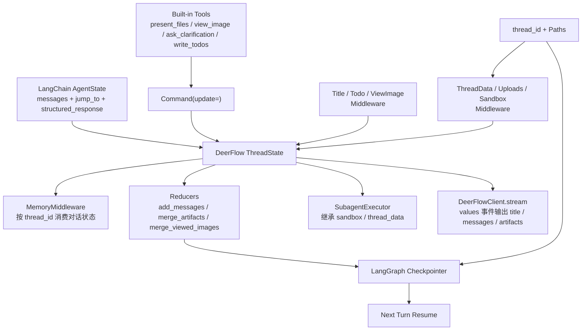
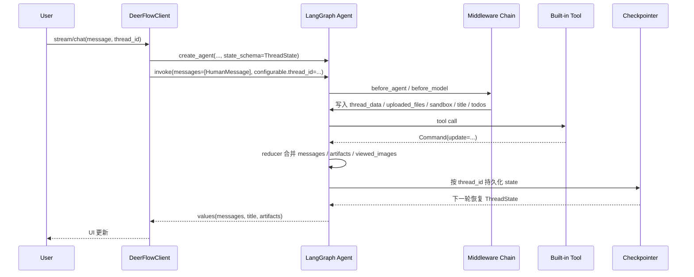

# DeerFlow 源码解读：Thread State System

## 1. 这套 Thread State System在解决什么问题

DeerFlow 的 Thread State，本质上是在解决一个更底层的问题：

如何把“单轮对话消息”升级成“可被 LangGraph 接住、可被工具回写、可被 middleware 共享、可被 checkpointer 持久化、可被前端消费”的统一线程状态。

`ThreadState` 是 DeerFlow runtime 里最重要的共享数据面之一，具体解决的问题如下：

1. 当前 thread 对应的工作目录、上传目录、输出目录
2. 当前 thread 绑定了哪个 sandbox
3. 这一轮执行生成了哪些可展示产物
4. 模型是否已经看过某些图片，以及这些图片如何在下一次 model call 中重新注入
5. todo、title、uploaded_files 这类既影响运行时也影响 UI 的状态
6. 这些状态如何跨轮延续，而不是每次都从零开始

## 2. 架构总览

### 2.1 分层视角

Thread State可以粗略分成四层：


| 层次           | 作用                                                       | 代表源码                                                                |
| -------------- | ---------------------------------------------------------- | ----------------------------------------------------------------------- |
| 状态定义层     | 定义 thread 级状态槽位，以及哪些字段需要 reducer           | `agents/thread_state.py`                                                |
| 状态生产层     | 在 agent 启动、model 调用、tool 调用过程中写入或修补状态   | `agents/middlewares/*.py`、`tools/builtins/*.py`                        |
| 合并与持久化层 | 把状态更新合并进 LangGraph state，并按`thread_id` 跨轮保存 | `langchain.agents.create_agent(...)`、`agents/checkpointer/provider.py` |
| 消费层         | 下一轮推理、子代理、前端流式输出都从这里读取状态           | `client.py`、`subagents/executor.py`、各类 middleware                   |

可以把它理解成：先定义“线程里应该记住什么”，再决定“谁来写这些状态”，接着由 LangGraph 负责“怎么合并、怎么持久化”，最后由 agent、subagent 和前端一起消费。

结合下面的架构图对四层进行详细的解释：

### 2.2 架构图



ThreadState呈沙漏型的系统设计，在这个架构中，`ThreadState` 占据了正中央的“细腰”位置，扮演着数据总线的角色。

1. 状态定义层

   1. **流程节点**：`LangChain AgentState` ➔ `DeerFlow ThreadState`
   2. `DeerFlow ThreadState`继承了`LangChain AgentState`。继承了所有基础的 `messages`增删改查、以及底层图的`jump_to` 控制流。
2. 状态生产层（系统里有哪些角色在不断地向 `ThreadState` 写入数据？）

   1. **运行时上下文（Middleware）**：图中的 `ThreadData / Uploads / Sandbox Middleware` 以及 `Title / Todo Middleware`。在每次模型调用前，把当前线程对应的 `thread_id`、工作目录路径、上传的文件元数据、乃至需要绑定的沙盒环境，默默塞进状态里。
   2. **工具执行的结果（Build-in Tools）**：当大模型调用了如展示文件（`present_files`）、查看图片（`view_image`）等工具时，工具函数不会直接去碰 UI，而是统一封装成 LangGraph 的 `Command(update=...)` 协议向图引擎发送更新指令，将新产物写入状态。
3. 合并与持久化层（下方的持久化链路）

   1. **流程节点**：`ThreadState` ➔ `Reducers` ➔ `LangGraph Checkpointer` ➔ `Next Turn Resume`
   2. **解释**：当大量的更新请求涌入 `ThreadState` 时，系统必须保证数据不乱。此时 `Reducers`（合并策略）开始工作，将增量更新安全地合并到主状态中。合并完成后，状态被交给 `Checkpointer`，以 `thread_id` 为key，将这一刻的“系统快照”落盘到数据库（如 SQLite/Postgres）中。这就实现了图中所写的“Next Turn Resume”，赋予了 Agent 跨越多轮对话的“长时记忆”与断点续传能力。
4. 消费层（被合并和持久化后的 `ThreadState`最终服务于谁？）

   1. **同级与下级的 AI 消费**：例如 `MemoryMiddleware` 会读取对话状态来进行记忆清算；`SubagentExecutor`（子代理）在启动时，会直接继承主线程的 `sandbox` 和 `thread_data` 状态，确保父子 Agent 在同一个物理目录和沙盒里干活，而不是各玩各的。
   2. **用户层的前端消费**：图右侧最关键的 `DeerFlowClient.stream`。客户端通过监听图状态的 `values` 事件，把状态中剥离出来的 `title`、`messages`、`artifacts`（渲染图表或文件的卡片）直接流式推给前端 UI。

## 3. 执行时序图



这段执行时序图清晰地展示了 **ThreadState在一次完整的用户请求流中是如何被创建、修改、流转并最终落地的**。
我们可以将这个时序图拆解为以下五个关键阶段来理解：

1. 请求发起与状态约定（User -> Client -> Agent）

   - **动作**：用户在前端输入消息，客户端（`DeerFlowClient`）携带 `thread_id` 发起流式调用。
   - **核心逻辑**：在调用 LangGraph 核心图之前，客户端通过 `create_agent` 初始化代理，并显式传入了 `state_schema=ThreadState`。它相当于和底层框架签了一份“状态合同”，规定了后续图执行过程中可以存取哪些字段（如 `artifacts`、`sandbox` 等）。
2. 中间件的状态装配（Agent <-> Middleware）

   - **动作**：在模型真正进行推理前（`before_agent` / `before_model` 钩子），请求会被中间件链（Middleware Chain）拦截。
   - **核心逻辑**：中间件负责将业务运行时上下文“注入”到状态中。例如，根据 `thread_id` 算出工作目录并写入 `thread_data`；解析用户上传的文件写入 `uploaded_files`；绑定或初始化沙盒写入 `sandbox` 等。此时，原本单薄的消息体被扩充成了拥有完整上下文的“富状态”。
3. 工具执行与状态回写（Agent <-> Tool）

   - **动作**：大模型决定调用某个内置工具（如查看图片、展示文件等），工具执行完毕后，向图返回 `Command(update=...)`。
   - **核心逻辑**：这是这套系统最优雅的地方之一。工具不仅仅返回一段字符串结果给大模型，而是通过 `Command` 协议**直接修改外部状态**。比如 `view_image_tool` 会把图片 Base64 写入 `viewed_images`，`present_files` 会将路径写入 `artifacts`。
4. 状态归并与持久化（Reducer -> Checkpointer）

   - **动作**：图执行完毕一个节点后，触发状态更新机制。
   - **核心逻辑**：LangGraph 根据 `ThreadState` 中定义的合并策略（Reducers，例如 `merge_artifacts` 的去重合并，`merge_viewed_images` 的字典合并），将工具和中间件产生的新状态安全地融合到全局状态中。随后，`Checkpointer` 登场，以 `thread_id` 为键，将这份合并后的完整状态持久化到存储层（如 SQLite/Postgres），确保下一轮对话能够完美恢复现场。
5. 状态向外延展驱动 UI（Agent -> Client -> User）

   - **动作**：持久化完成后，图引擎将状态变更通过 `values` 事件流式吐出给客户端。
   - **核心逻辑**：`ThreadState` 不仅服务于后端推理，它的子集直接成为了前端渲染的数据源。前端拿到 `messages` 刷新对话列表，拿到 `artifacts` 渲染生成的文件卡片，拿到 `title` 更新会话窗口标题。

**总结来说：** 这张图揭示了 `ThreadState` 作为一条贯穿全局的“数据总线”，完美串联了**模型推理上下文**（Messages）、**系统运行时资源**（Sandbox/Paths）、**工具执行副作用**（Artifacts）以及**前端视图呈现**（UI 更新）。

## 4. `ThreadState` 里定义了哪些字段

### 4.1 核心定义

`backend/packages/harness/deerflow/agents/thread_state.py` 的核心定义非常短，但通过 `TypedDict` 和 `Annotated` 做了严格的类型和行为约束：：

```python
class ThreadState(AgentState):
    sandbox: NotRequired[SandboxState | None]
    thread_data: NotRequired[ThreadDataState | None]
    title: NotRequired[str | None]
    artifacts: Annotated[list[str], merge_artifacts]
    todos: NotRequired[list | None]
    uploaded_files: NotRequired[list[dict] | None]
    viewed_images: Annotated[dict[str, ViewedImageData], merge_viewed_images]
```

`ThreadState` 包含了三层关键设计：

1. **继承基类**：继承了 LangChain/LangGraph 的 `AgentState`，复用了底层的消息流转能力。
2. **结构化子状态**：将复杂的上下文（如沙盒、目录、图片）封装为独立的 `TypedDict`，而不是扁平化地堆砌字段。
3. **声明式合并（Reducer）**：使用 `Annotated[..., reducer]` 明确声明了部分列表和字典类型字段在跨节点更新时的合并策略。

下面对这三层分别展开进行解释：

### 4.2 从 LangChain 继承来的字段

由于继承了 `AgentState`，DeerFlow 自动获得了 LangChain/LangGraph 生态的标准底层字段（特别是 `messages`），这意味着 DeerFlow 不需要自己再造一套 message history 机制，而是直接复用：

- `messages` 继续走 LangGraph 官方的 `add_messages` reducer
- `jump_to` 继续保留 LangGraph 控制流跳转能力
- `structured_response` 继续兼容结构化输出

### 4.3 DeerFlow 原生扩展的业务状态


| 业务平面   | 字段             | 含义                                                                                 | 主要写入方                                          | 合并策略                       |
| ---------- | ---------------- | ------------------------------------------------------------------------------------ | --------------------------------------------------- | ------------------------------ |
| 运行时控制 | `sandbox`        | 绑定当前线程的沙盒句柄（核心是`sandbox_id`），由 Middleware 在需要时按需初始化       | `SandboxMiddleware`、`ensure_sandbox_initialized()` | 默认覆盖                       |
| 运行时控制 | `thread_data`    | 线程工作目录、上传目录、输出目录                                                     | `ThreadDataMiddleware`                              | 默认覆盖                       |
| UI 与产物  | `title`          | 会话标题，主要给 UI 用                                                               | `TitleMiddleware`                                   | 默认覆盖                       |
| UI 与产物  | `artifacts`      | 本轮生成的可向用户展示的产物文件路径（如通过`present_file_tool` 输出的图表、报告等） | `present_file_tool(...)`                            | `merge_artifacts` 去重合并     |
| UI 与产物  | `uploaded_files` | 记录当前回合用户上传的文件元数据，既用于前端呈现，也被转化为模型可读的内容           | `UploadsMiddleware`                                 | 默认覆盖                       |
| 推理辅助   | `todos`          | 计划模式（Plan Mode）下的任务清单，作为可跨越消息裁剪的持久化执行状态                | `TodoListMiddleware` / `write_todos`                | 默认整体替换                   |
| 推理辅助   | `viewed_images`  | 已读取图片的 base64 和 MIME 信息                                                     | `view_image_tool(...)`                              | `merge_viewed_images` 字典合并 |

这里最重要的不是字段数量，而是这些字段覆盖了三种完全不同的需求：

1. **运行时控制状态**：`sandbox`、`thread_data`
2. **用户可见产物状态**：`title`、`artifacts`、`uploaded_files`
3. **推理辅助状态**：`todos`、`viewed_images`

这说明 DeerFlow 的 thread state 并不是“只给框架自己用”，而是同时服务于 runtime、推理和 UI。

### 4.4 Reducer（合并策略）的设计巧思

在状态图中，如果多个节点（或工具）并发修改同一个字段，系统必须知道如何合并这些修改。`ThreadState` 中真正带有自定义 Reducer 的只有两个扩展字段，它们各自体现了绝佳的设计考量：

1. `artifacts`: 使用 `merge_artifacts`（有序去重合并）

   ```python
   def merge_artifacts(existing: list[str] | None, new: list[str] | None) -> list[str]:
       # ... 
       return list(dict.fromkeys(existing + new))
   ```

   * 当有新的产物（Artifacts）生成时，不是直接覆盖旧的，而是追加合并。
   * 使用 `dict.fromkeys(existing + new)`，这不仅实现了产物路径的去重，还**完美保留了产物生成的先后顺序**。这对于前端按序渲染时间线卡片至关重要。
2. `viewed_images`: 使用 `merge_viewed_images`（字典覆盖与一键清空）

   ```python
   def merge_viewed_images(existing: dict[str, ViewedImageData] | None, new: dict[str, ViewedImageData] | None) -> dict[str, ViewedImageData]:
       # ...
       if len(new) == 0:
           return {}
       return {**existing, **new}
   ```

   * 按图片路径（`image_path`）作为 key 进行字典合并，相同的 key 会被新数据覆盖。
   * 特别设计了**如果传入空字典 `{}` 则清空所有图片的特殊逻辑**。这使得 Middleware（例如在跨轮清算或上下文清理时）拥有了随时清空已读图片缓存的“合法途径”，避免 Base64 数据无限膨胀导致 Token 溢出。

## 5. 建议阅读顺序

如果你准备继续深挖源码，可以按这个顺序读：


| 顺序 | 文件                                                                             | 为什么先读它                           |
| ---- | -------------------------------------------------------------------------------- | -------------------------------------- |
| 1    | `backend/packages/harness/deerflow/agents/thread_state.py`                       | 看状态字段和 reducer 定义              |
| 2    | `backend/packages/harness/deerflow/agents/middlewares/thread_data_middleware.py` | 看 thread 目录如何进入 state           |
| 3    | `backend/packages/harness/deerflow/agents/middlewares/uploads_middleware.py`     | 看上传文件如何同时写进 state 和消息    |
| 4    | `backend/packages/harness/deerflow/sandbox/middleware.py`                        | 看 sandbox 如何绑定到 thread           |
| 5    | `backend/packages/harness/deerflow/tools/builtins/present_file_tool.py`          | 看 artifacts 如何通过`Command` 回写    |
| 6    | `backend/packages/harness/deerflow/tools/builtins/view_image_tool.py`            | 看图片状态如何写入`viewed_images`      |
| 7    | `backend/packages/harness/deerflow/agents/middlewares/view_image_middleware.py`  | 看 state 如何再被转成多模态 message    |
| 8    | `backend/packages/harness/deerflow/agents/middlewares/todo_middleware.py`        | 看为什么 todo 能跨上下文裁剪继续存在   |
| 9    | `backend/packages/harness/deerflow/agents/lead_agent/agent.py`                   | 看完整 middleware 链如何装配           |
| 10   | `backend/packages/harness/deerflow/client.py`                                    | 看`thread_id`、`values` 输出和前端契约 |
| 11   | `backend/packages/harness/deerflow/agents/checkpointer/provider.py`              | 看状态如何落到 memory/sqlite/postgres  |

## 6. 源码解析

### 6.1 `ThreadState` 

`ThreadState` 自己并不负责持久化，它只是 schema。

真正把它接进运行图的地方，是这些 `create_agent(...)` 调用：

- `backend/packages/harness/deerflow/agents/lead_agent/agent.py`
- `backend/packages/harness/deerflow/client.py`
- `backend/packages/harness/deerflow/agents/factory.py`
- `backend/packages/harness/deerflow/subagents/executor.py`

这些地方都会显式传入：

```python
create_agent(
    ...,
    state_schema=ThreadState,
    checkpointer=...,
)
```

这一步的意义是：

1. 告诉 LangChain / LangGraph，这个 agent 的 state 不是默认最小集合，而是 DeerFlow 扩展后的 `ThreadState`
2. 后续 middleware、tool、streaming、checkpointer 都围绕这份 schema 工作

所以更准确地说，`ThreadState` 是 DeerFlow 对 LangGraph state graph 暴露出来的“线程状态合同”。

### 6.2 thread 启动时，状态是怎么被补齐的

Thread State System 的第一批写入主要来自 runtime middleware。

基础顺序在 `build_lead_runtime_middlewares(...)` 里已经固定了：

1. `ThreadDataMiddleware`
2. `UploadsMiddleware`
3. `SandboxMiddleware`
4. `DanglingToolCallMiddleware`
5. `ToolErrorHandlingMiddleware`
6. 后续再叠加 title、memory、todo、view_image、clarification 等 lead-only middleware

其中最关键的是前三个：

#### `ThreadDataMiddleware`

它根据 `thread_id` 计算三条 thread-local 路径：

- `workspace_path`
- `uploads_path`
- `outputs_path`

这些路径来自 `config/paths.py`，最终会映射到：

- `.../threads/{thread_id}/user-data/workspace`
- `.../threads/{thread_id}/user-data/uploads`
- `.../threads/{thread_id}/user-data/outputs`

这一步的意义不是“顺手记个路径”，而是把 thread 的文件系统边界写入 state，让所有后续工具都能共享同一份目录上下文。

#### `UploadsMiddleware`

它读取最后一条用户消息里的 `additional_kwargs.files`，把上传文件信息写进：

- `uploaded_files`
- `messages`

更具体地说，它会把一个 `<uploaded_files>...</uploaded_files>` 块插进最后一条 `HumanMessage` 里，让模型知道这一轮有哪些文件可读。

这里很有意思的一点是：上传文件既进入结构化 state，也进入 message history。也就是说，DeerFlow 同时照顾了“程序可读”和“模型可读”这两个平面。

#### `SandboxMiddleware`

它负责给当前 thread 绑定 sandbox。默认是 lazy init：

- agent 启动时先不急着创建 sandbox
- 等第一个 sandbox tool 真正执行时，再通过 `ensure_sandbox_initialized(...)` 获取
- 获取后把 `sandbox_id` 写回 `runtime.state["sandbox"]`

这说明 DeerFlow 的 state system 不只是被动记录结果，它还参与 runtime 资源生命周期管理。

### 6.3 tool 调用后，状态怎么被写回

Thread State System 最好看的部分，其实在 built-in tools 里。

#### `present_file_tool(...)`

`present_files` 并不是只返回一句“文件生成成功”，而是会：

1. 把宿主机路径或虚拟路径统一规范到 `/mnt/user-data/outputs/*`
2. 返回 `Command(update=...)`
3. 把规范化后的路径写进 `artifacts`
4. 同时补一条 `ToolMessage`

也就是说，产物展示不是靠模型“口头声明”，而是靠工具显式回写 state。

#### `view_image_tool(...)`

`view_image` 也不是简单读取文件。它会：

1. 把图片读成 base64
2. 推断 MIME type
3. 返回 `Command(update={"viewed_images": ..., "messages": [...]})`

紧接着，`ViewImageMiddleware` 会在下一次 model call 前检查：

- 上一条 assistant message 里是否有 `view_image` tool call
- 这些 tool call 是否都已经收到了对应 `ToolMessage`

如果是，就把 `viewed_images` 里的图片重新组织成带 `image_url` 的 `HumanMessage` 注入消息流。

这条链路非常典型：

> tool 先把二进制图像能力写入 state，middleware 再把 state 转译成模型真正能“看见”的 multimodal message。

所以 `viewed_images` 不是终点，它更像一个“多模态桥接缓冲层”。

#### `ask_clarification`

`ask_clarification` 更能说明 LangGraph state 的价值。

它不是简单执行一个工具函数，而是由 `ClarificationMiddleware` 拦截 tool call，直接返回：

- `Command(update={"messages": [ToolMessage(...)]}, goto=END)`

这意味着同一个 `Command` 同时完成两件事：

1. 更新消息状态
2. 改变图执行流，结束当前 run，等待用户回复

换句话说，在 DeerFlow 里，“状态更新”和“控制流切换”不是两套分离机制，而是 LangGraph `Command` 的同一个协议。

### 6.4 为什么 todo 在被总结或裁剪后仍然能活着

`TodoMiddleware` 是这套设计里很巧的一点。

LangChain 自带的 `TodoListMiddleware` 会通过 `write_todos` 工具把 todo 列表写入 `todos` state。但 DeerFlow 又额外处理了一层边角情况：

- 如果后续 `SummarizationMiddleware` 把原始 `write_todos` 调用从消息窗口里裁掉了
- 模型可能会“忘记”自己当前还有 todo list

DeerFlow 的 `TodoMiddleware` 会检查：

- `todos` 还在不在 state 里
- 当前 `messages` 里还看不看得到 `write_todos`

如果 todo 还在、但消息里已经看不到了，它会自动注入一条 `todo_reminder` 的 `HumanMessage`。

这里很能体现 thread state 的价值：

> message window 可以被裁剪，但状态本身不必跟着丢。

也因此，`todos` 不是单纯的 UI 附件，而是一种能跨上下文压缩继续存在的执行状态。

### 6.5 checkpointer 才决定“跨轮延续”，不是 `ThreadState` 本身

很多人第一次看这类代码时会把“有状态”和“已持久化”混在一起。

在 DeerFlow 里，两者其实是分开的：

- `ThreadState` 决定“有哪些状态槽位”
- `checkpointer` 决定“这些状态能否跨轮保存”

这条线在 `DeerFlowClient` 里非常清楚：

1. `_get_runnable_config(...)` 把 `thread_id` 放进 `configurable`
2. `_ensure_agent(...)` 创建 agent 时注入 `checkpointer`
3. 没显式传入 checkpointer 时，会走 `get_checkpointer()`
4. `get_checkpointer()` 可以返回 `InMemorySaver`、`SqliteSaver` 或 `PostgresSaver`

因此更准确地说：

- `ThreadState` 负责定义状态结构
- `thread_id` 负责给状态找到恢复键
- `checkpointer` 负责决定这份状态是只活在当前进程里，还是能真正持久化到外部存储

在 DeerFlow 里，如果没有显式配置持久化后端，`get_checkpointer()` 至少也会回退到 `InMemorySaver`。这意味着：

- 同一进程内，多轮状态通常仍然可以延续
- 但如果进程重启，这份状态就不会留下来
- 想要真正 durable 的 thread state，就要换成 sqlite 或 postgres backend

这个分层是很干净的，因为同一个 `ThreadState` 可以跑在：

- in-memory
- sqlite
- postgres

而不需要修改任何业务字段定义。

### 6.6 子代理为什么能继承主线程上下文

`SubagentExecutor` 也在用同一个 `ThreadState`。

它在启动 subagent 时会把父代理里的：

- `sandbox`
- `thread_data`

原样塞进 subagent 的初始 state。

这带来的结果是：

1. 子代理有独立消息历史
2. 但它共享同一 thread 的目录和 sandbox 视图
3. 所以主代理和子代理可以在同一工作区里协作，而不会各用各的临时目录

这其实说明 `ThreadState` 不只是“单个 agent run 的状态”，它还是 DeerFlow 多代理协作时的上下文接力面。

### 6.7 前端为什么能直接消费这些状态

`DeerFlowClient.stream(...)` 在 `values` 事件里会直接吐出：

- `title`
- `messages`
- `artifacts`

这说明 `ThreadState` 还有一个常被忽略的角色：

> 它不仅是 runtime state，也是前端数据契约的一部分。

比如：

- `title` 决定线程标题展示
- `artifacts` 决定用户能看到哪些输出文件
- `messages` 决定聊天界面如何增量刷新

所以 DeerFlow 的 state system 并不只服务模型推理，它同时服务用户界面。

## 7. DeerFlow 这套设计巧妙在哪

### 7.1 不重造 agent state，而是扩展框架原语

DeerFlow 没有自己造一个完全独立的“会话上下文对象”，而是直接继承 LangChain 的 `AgentState`。

这样做的好处是：

- 直接复用 `messages`、`structured_response`、`jump_to`
- 更容易和 `create_agent(...)`、middleware、ToolRuntime 对齐
- 对 LangGraph 来说，这依然是一份标准 state schema

这是很典型的“顺着框架设计，而不是逆着框架打补丁”。

### 7.2 把字段级 merge semantics 显式化

很多系统会把状态合并逻辑藏在工具内部或业务代码里，最后很难解释“为什么这个字段被覆盖了，那个字段被追加了”。

DeerFlow 反过来做：

- `messages` 明确走 `add_messages`
- `artifacts` 明确走 dedupe merge
- `viewed_images` 明确走 dict merge

这让状态行为变得很可推理。

### 7.3 middleware 只声明自己需要的 state 子集

你会发现很多 middleware 没有直接依赖完整 `ThreadState`，而是各自声明一个“兼容 `ThreadState` 的更小 state schema”。

例如：

- `TitleMiddlewareState` 只关心 `title`
- `ThreadDataMiddlewareState` 只关心 `thread_data`
- `ViewImageMiddlewareState` 只关心 `viewed_images`

这非常像一种“结构化鸭子类型”：

- middleware 不需要知道整个系统所有状态
- 只要它关心的那部分字段在总 state 里存在即可

这能明显降低耦合度。

### 7.4 同一份状态同时服务 runtime、推理和 UI

`ThreadState` 里既有：

- `sandbox`、`thread_data` 这种运行时字段
- `todos`、`viewed_images` 这种推理辅助字段
- `title`、`artifacts`、`uploaded_files` 这种 UI 字段

这说明 DeerFlow 把线程状态当成“共享事实层”，而不是某个单独模块的内部变量。

### 7.5 状态比消息窗口更稳定

`TodoMiddleware` 是最好的例子。

消息可能被裁剪、摘要、替换，但只要 todo 还在 state 里，系统就能想办法把它重新注入给模型。这相当于把“上下文连续性”从 message history 提升到了 state 层。

对长任务 agent 来说，这一点非常关键。

### 7.6 `ThreadState` 和 checkpointer 的职责分离很干净

schema 决定“记什么”，checkpointer 决定“存多久、存到哪”。

这种解耦让 DeerFlow 在：

- SDK 嵌入调用
- LangGraph Server
- 本地开发
- sqlite / postgres 部署

之间切换时，不需要改业务 state 结构。

## 8. 涉及到的 LangChain / LangGraph 知识

### 8.1 `AgentState`

`AgentState` 是 LangChain agent 默认使用的状态 schema。

- `messages` 是必需字段
- `messages` 默认带 `add_messages` reducer
- 它还内建了 `jump_to` 和 `structured_response`

DeerFlow 的 `ThreadState` 本质上就是在这个基类上加字段。

### 8.2 `state_schema=...`

`create_agent(..., state_schema=ThreadState)` 不是普通类型标注，而是在告诉 LangGraph：

- 这个图上的 state 长什么样
- 哪些字段带 reducer
- tool 和 middleware 可以写哪些键

没有这一步，DeerFlow 自己补的 `artifacts`、`viewed_images`、`thread_data` 等字段就不会进入统一状态契约。

### 8.3 `Annotated[..., reducer]`

LangGraph 用 `Annotated` 给字段附加 reducer。

这意味着字段不只是“类型是什么”，还包括“更新时怎么合并”。这正是 `messages`、`artifacts`、`viewed_images` 能表现出不同状态语义的根源。

### 8.4 `Command(update=..., goto=...)`

`Command` 是 LangGraph 里很核心的一个原语。

它至少能做两件事：

1. `update=...`：更新 state
2. `goto=...`：改变图里的下一跳

在 DeerFlow 里：

- `present_files`、`view_image` 用它回写状态
- `ask_clarification` 用它同时更新消息并结束当前 run

所以 `Command` 是 Thread State System 和图控制流之间的桥。

### 8.5 `ToolRuntime[ContextT, ThreadState]`

DeerFlow 的 built-in tools 基本都写成：

```python
def some_tool(runtime: ToolRuntime[ContextT, ThreadState], ...):
    ...
```

这意味着工具在执行时可以显式访问：

- `runtime.state`
- `runtime.context`
- `runtime.config`

也就是：

- 它知道当前 thread 的状态
- 它知道当前 `thread_id`
- 它知道调用期配置

这正是工具能读取 `thread_data`、复用 `sandbox`、更新 `viewed_images` 的基础。

### 8.6 `AgentMiddleware`

DeerFlow 大量使用了 LangChain 的 middleware hook：

- `before_agent`
- `before_model`
- `after_model`
- `after_agent`
- `wrap_model_call`
- `wrap_tool_call`

Thread State System 的大量状态写入，其实不是发生在 graph 节点函数里，而是发生在这些 middleware hook 里。

### 8.7 `checkpointer`

LangGraph 的 checkpointer 负责把状态按线程键持久化。

在 DeerFlow 里：

- `thread_id` 是恢复键
- `InMemorySaver` / `SqliteSaver` / `PostgresSaver` 是不同持久化后端

因此“多轮对话是否连续”这件事，本质上不是模型能力，而是 graph state persistence 能力。

## 9. 总结

`ThreadState` 其实是 DeerFlow runtime 里一个非常关键的系统设计：

> 它把消息、线程目录、sandbox、产物、图片、todo、标题这些原本分散在不同模块里的事实，收束成了一份可以被 LangGraph 合并、被 checkpointer 持久化、被 middleware 共享、被前端消费的统一线程状态。

因此，Thread State System 的真正价值在于它让 DeerFlow 从“聊天式工具调用”走向了“有状态的任务执行系统”。
