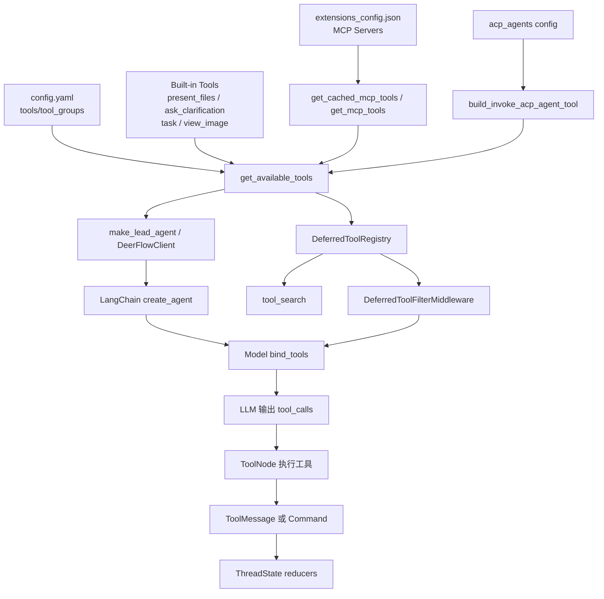

# DeerFlow 源码解读：Tool System

## 1. 这套 Tool System 在解决什么问题

DeerFlow 的 Tool System 本质上不是“把几个工具函数丢给模型”这么简单，而是一套围绕 工具发现、按需装配、上下文控制、执行回写、错误兜底 建起来的运行时系统。

DeerFlow这套Tool System至少解决了五件事：

1. `config.yaml` 里的工具配置如何变成真正可调用的 `BaseTool`
2. 不同来源的工具如何统一收口到同一个 agent 里
3. 哪些工具应该暴露给模型，哪些工具只在运行时按需发现
4. 工具执行后的结果如何安全回写到 LangGraph state
5. 工具出错、调用中断、异步工具桥接等边角情况如何被兜住

## 2. 架构总览

### 2.1 分层视角

Tool System 可以分成四层：

```python
┌────────────────────────────┐
│ 配置与发现层                 │
│ config / builtins / MCP    │
└────────────┬───────────────┘
             │
┌────────────▼───────────────┐
│ 装配与暴露层                 │
│ bind_tools / tool_search   │
└────────────┬───────────────┘
             │
┌────────────▼───────────────┐
│ 执行层                      │
│ model -> tool_calls        │
└────────────┬───────────────┘
             │
┌────────────▼───────────────┐
│ 状态回写层                   │
│ ToolMessage / Command      │
└────────────────────────────┘


```

可以粗略理解为：先“收集能力”，再“决定暴露什么”，然后“执行调用”，最后“把副作用并回状态”。


| 层次         | 作用                                       | 代表源码                                                                              |
| ------------ | ------------------------------------------ | ------------------------------------------------------------------------------------- |
| 配置与发现层 | 从配置、MCP、ACP、内置工具收集工具对象     | `config/tool_config.py`、`tools/tools.py`、`mcp/tools.py`                             |
| 装配与暴露层 | 决定哪些工具真正绑定给模型，哪些只延迟暴露 | `agents/lead_agent/agent.py`、`agents/middlewares/deferred_tool_filter_middleware.py` |
| 执行层       | 把模型发出的 tool call 路由到具体工具      | LangChain/LangGraph 的`create_agent` + `ToolNode` 机制                                |
| 状态回写层   | 把工具副作用写回`ThreadState`              | `agents/thread_state.py`、`tools/builtins/*.py`                                       |

1. 配置与发现层：
   1. 工具来源通常很多，有的是 DeerFlow 自带的 built-in 工具，有的是 `config.yaml` 里配置的社区工具，有的是 MCP server 暴露出来的外部工具，还有像 ACP 这种“把外部 agent 也当工具”的能力。如果没有这一层，后面的 agent 根本不知道自己到底有哪些能力，更不用说统一装配和统一管理。
   2. 实际场景里，用户可能只是说一句“先去网上查资料，再整理成文件”。对模型来说，这背后可能要用到 `web_search`、`web_fetch`、`write_file`，甚至某个 MCP 提供的专用工具。配置与发现层的作用，就是先把这些不同来源的能力收集起来，变成一组统一、可调度的工具对象。
2. 装配与暴露层：
   1. 当工具已经被系统收集起来后，第二个问题就变成了：哪些工具现在应该暴露给模型，哪些不应该。这里要解决的不是“工具存不存在”，而是“模型当前看见什么最合适”。因为工具一多，模型更容易选错；工具 schema 一长，prompt 上下文也会被吃掉。所以一个成熟系统通常会有一层专门负责装配和暴露，控制哪些工具进入 `bind_tools`，以及哪些工具只在需要时再按需发现。
   2. 实际场景里，MCP server 可能一下子带来几十个工具。如果全部直接丢给模型，模型会很容易在一堆相似工具里迷路。DeerFlow 的 `tool_search` 机制就是这一层的典型做法：先让模型知道“有这些工具”，但不把全部 schema 一次性塞进去，等它真的需要时再去查。
3. 执行层：
   1. 模型表达出“我想调哪个工具、传什么参数”，执行层把这次调用交给具体工具实现、拿到返回结果、处理执行过程。也就是说，这一层负责把“模型的决定”变成“系统做了这件事”。
   2. 实际场景里，模型可能输出一个 `view_image` 调用，说它想看某张图片，或者输出一个 `task` 调用，把工作委派给子代理。只有进入执行层后，这些调用才会真的被路由到对应工具函数，读取图片、启动子代理、返回执行结果。
4. 状态回写层：
   1. agent 工具系统不能只关心“工具有没有成功执行”，还要关心“执行结果有没有被后续流程接住”。如果工具跑完只是返回一句文本，那么下一轮对话、前端界面、后续工具都不一定知道刚刚发生了什么。状态回写层的作用，就是把工具执行后的结果写回运行时状态，例如消息、文件产物、图片内容、其他副作用，这样后面的链路才能继续利用这些结果。
   2. 实际场景里，`present_files` 如果只返回一句“文件已生成”，那前端并不知道文件在哪，也没法给用户展示下载入口。真正有用的做法是把文件路径写进 `artifacts`。同样，`view_image` 也不只是说“读图成功”，而是把图片数据写回 `viewed_images`。这样下一轮 agent 和前端界面才能真正基于这些结果继续工作。

### 2.2 架构图



把上面 `2.1` 的四个分层重新投影到这张图里：

1. **配置与发现层**：图上面的 `config.yaml`、`Built-in Tools`、`extensions_config.json`、`acp_agents config` 是能力来源；`get_cached_mcp_tools / get_mcp_tools` 和 `build_invoke_acp_agent_tool` 负责把外部能力转成 DeerFlow 可用工具；`get_available_tools` 则是这一层的汇聚点。
2. **装配与暴露层**：`make_lead_agent / DeerFlowClient` 和 `LangChain create_agent` 负责把工具真正装进 agent；而 `DeferredToolRegistry -> tool_search -> DeferredToolFilterMiddleware -> bind_tools` 这条支线，解决的是哪些 schema 现在就暴露给模型，哪些延迟暴露。
3. **执行层**：`Model bind_tools -> LLM 输出 tool_calls -> ToolNode 执行工具` 这一段，就是模型真正发起工具调用、再由 LangChain / LangGraph 路由到具体工具执行的运行链路。
4. **状态回写层**：工具执行后返回的 `ToolMessage 或 Command` 会进入 `ThreadState reducers`，把产物、图片、消息等副作用并回运行时状态，而不是只停留在一次性的文本响应里。

这张图展示了Tool System里的主链和支线：主链是“发现能力 -> 装配 agent -> 执行 tool call -> 回写状态”，支线则是 deferred tools 的“延迟暴露机制”，它影响的是模型看到什么 schema，而不是工具能否被执行。

## 3. 建议阅读顺序

源码建议按下面顺序读：


| 顺序 | 文件                                                                                      | 为什么先读它                                    |
| ---- | ----------------------------------------------------------------------------------------- | ----------------------------------------------- |
| 1    | `backend/packages/harness/deerflow/tools/tools.py`                                        | 总入口，先看 DeerFlow 到底从哪里收集工具        |
| 2    | `backend/packages/harness/deerflow/mcp/tools.py`                                          | 看 MCP 工具怎么被拉平到`BaseTool`               |
| 3    | `backend/packages/harness/deerflow/mcp/cache.py`                                          | 看为什么 MCP 工具要缓存，以及缓存何时失效       |
| 4    | `backend/packages/harness/deerflow/tools/builtins/tool_search.py`                         | 看延迟加载 schema 的核心机制                    |
| 5    | `backend/packages/harness/deerflow/agents/middlewares/deferred_tool_filter_middleware.py` | 看“已加载但不直出给模型”的实现点              |
| 6    | `backend/packages/harness/deerflow/agents/lead_agent/agent.py`                            | 看工具最终怎么进入`create_agent(...)`           |
| 7    | `backend/packages/harness/deerflow/tools/builtins/task_tool.py`                           | 看子代理为什么也能被抽象成普通工具              |
| 8    | `backend/packages/harness/deerflow/tools/builtins/invoke_acp_agent_tool.py`               | 看外部 ACP agent 如何接入同一套模型工具协议     |
| 9    | `backend/packages/harness/deerflow/agents/thread_state.py`                                | 看工具执行后的状态更新是怎么被 LangGraph 接住的 |

## 4. 源码解析

### 4.1 配置工具如何变成真正的 `BaseTool`

工具定义最开始只是一段配置：

- `config.example.yaml` 里用 `tools:` 声明工具
- `ToolConfig` 里把每个工具抽象成 `name / group / use`
- `use` 是一个反射路径，例如 `deerflow.sandbox.tools:bash_tool`

对应的解析逻辑在：

- `backend/packages/harness/deerflow/config/tool_config.py`
- `backend/packages/harness/deerflow/reflection/resolvers.py`

其中 `resolve_variable(...)` 会把字符串路径解析成真实 Python 对象。于是 DeerFlow 可以把“工具选择”这件事放在配置层，而不是写死在代码里。

这意味着：

- 社区工具可以通过改配置切换实现，例如 `web_search` 可以在 DDG、Tavily、InfoQuest 之间替换
- `tool_groups` 可以限制某个 agent 只看到某些能力
- Tool System 的扩展点是开放的，只要最终拿到的是 LangChain `BaseTool` 即可

### 4.2 `get_available_tools()`：真正的总装配函数

`backend/packages/harness/deerflow/tools/tools.py` 是整个 Tool System 最值得先读的文件。

它做的事情可以概括成下面这段伪流程：

```text
1. 从 config.tools 里解析静态工具
2. 拼上内置工具（present_files、ask_clarification）
3. 根据运行时参数决定是否加入 task_tool
4. 根据模型能力决定是否加入 view_image_tool
5. 读取 MCP 缓存；如果启用 tool_search，则把 MCP 工具注册到 DeferredToolRegistry
6. 如果配置了 ACP agents，则动态生成 invoke_acp_agent 工具
7. 返回一个统一的 BaseTool 列表
```

从“工具来源如何汇聚”角度看，可以总结为下面这张图：

```text
┌─────────────────────────────────────────────────────────────────────────┐
│                            Tool Sources                                 │
└─────────────────────────────────────────────────────────────────────────┘

┌─────────────────────┐  ┌─────────────────────┐  ┌─────────────────────┐
│   Built-in Tools    │  │  Configured Tools   │  │     MCP Tools       │
│  (deerflow/tools/)  │  │  (config.yaml)      │  │  (extensions.json)  │
├─────────────────────┤  ├─────────────────────┤  ├─────────────────────┤
│ - present_file      │  │ - web_search        │  │ - github            │
│ - ask_clarification │  │ - web_fetch         │  │ - filesystem        │
│ - view_image        │  │ - bash              │  │ - postgres          │
│ - task              │  │ - read_file         │  │ - brave-search      │
│                     │  │ - write_file        │  │ - puppeteer         │
│                     │  │ - str_replace       │  │ - ...               │
│                     │  │ - ls                │  │                     │
└─────────────────────┘  └─────────────────────┘  └─────────────────────┘
           │                       │                       │
           └───────────────────────┴───────────────────────┘
                                   │
                                   ▼
                      ┌─────────────────────────┐
                      │   get_available_tools() │
                      │(deerflow/tools/__init__)│
                      └─────────────────────────┘
```

这里有两个很重要的设计点：

#### 第一，工具来源被统一了

从 `get_available_tools()` 的返回值看，模型并不关心工具来自哪里：

- 来自 `config.yaml` 的社区工具
- DeerFlow 自带的 builtins
- MCP server 暴露出来的工具
- ACP agent 适配出来的工具

最后都变成了统一的 `BaseTool` 列表。

这让上层 `create_agent(model=..., tools=...)` 可以完全不区分来源。

#### 第二，工具是否使用是在运行时进行决策

例如：

- `task_tool` 只有在 `subagent_enabled=True` 时才出现
- `view_image_tool` 只有在 `model_config.supports_vision=True` 时才出现
- MCP 工具只有在对应 server 启用后才出现
- `invoke_acp_agent` 只有在 `acp_agents` 非空时才出现

这说明 DeerFlow 的 Tool System 不是静态注册表，而是 **按对话上下文和运行时能力拼装出来的工具视图**。

### 4.3 MCP 工具：外部协议接入，但内部仍然保持 LangChain 语义

MCP 接入主要在这两个文件：

- `backend/packages/harness/deerflow/mcp/tools.py`
- `backend/packages/harness/deerflow/mcp/cache.py`

核心流程是：

1. 读取 `extensions_config.json`
2. 通过 `build_servers_config(...)` 构建 MCP server 配置
3. 用 `MultiServerMCPClient` 拉取所有 MCP tools
4. 把工具补齐成同步可调用形式
5. 缓存在进程内，避免每次请求都重新握手和发现

这里最值得注意的是异步桥接：

- MCP adapter 返回的工具很多是异步 coroutine
- DeerFlow 自己的 client 流式执行路径里有同步调用场景
- 所以 `_make_sync_tool_wrapper(...)` 用线程池包了一层 `asyncio.run(...)`

这个桥接不是“为了好看”，而是为了让 MCP 工具在不同执行上下文里都还能以 LangChain 工具的方式被调用。

`mcp/cache.py` 也很实用：

- 启动时可以显式初始化
- 没初始化时允许懒加载
- `extensions_config.json` 的 mtime 变化会触发缓存失效

这让 DeerFlow 在 FastAPI、LangGraph Studio、嵌入式 client 等多种运行方式下都能工作。

### 4.4 `tool_search`：把“大量工具”问题转成“按需发现”问题

这是 Tool System 里最巧的一段设计。

当 MCP 工具很多时，如果全部直接传给模型，会带来两个问题：

1. system prompt 和 tool schema 变长，吃掉上下文窗口
2. 工具同质化严重时，模型更容易选错

DeerFlow 的做法不是简单裁剪，而是做了一个两阶段机制：

#### 阶段 A：先只暴露工具名字

`tool_search.enabled=true` 时：

- `get_available_tools()` 仍然会拿到 MCP tools
- 但这些工具会先进入 `DeferredToolRegistry`
- prompt 里只出现 `<available-deferred-tools>` 名字列表

相关源码：

- `backend/packages/harness/deerflow/tools/builtins/tool_search.py`
- `backend/packages/harness/deerflow/agents/lead_agent/prompt.py`

#### 阶段 B：需要时再拉完整 schema

当模型发现需要某个 deferred tool 时，它先调用 `tool_search(query)`。

`tool_search` 会：

- 在 `DeferredToolRegistry` 里匹配工具
- 用 `convert_to_openai_function(...)` 序列化成标准函数 schema
- 以 JSON 形式把匹配到的工具定义返回给模型

也就是说，DeerFlow 让模型先做一次“检索工具”，再做一次“调用工具”。

#### 阶段 C：中间件把 deferred tool 从 `bind_tools` 里剔掉

真正把这套机制闭环的是 `DeferredToolFilterMiddleware`：

- ToolNode 仍然持有完整工具集，保证运行时可执行
- 但在 `wrap_model_call(...)` 中，会把 deferred tool 从 `request.tools` 中剔除
- 最终模型绑定到的只是活跃工具 + `tool_search`

这一点非常关键，因为它把：

- “执行层的完整工具集”
- “模型感知到的 tool schema 集”

拆成了两层不同的数据面。

### 4.5 内置工具为什么不只是普通函数

看 `backend/packages/harness/deerflow/tools/builtins/*.py` 会发现，很多 builtins 不只是“返回字符串”。

比如：

- `view_image_tool(...)` 返回的是 `Command`
- `present_file_tool(...)` 返回的是 `Command`
- `ask_clarification_tool(...)` 虽然函数体只是占位，但真正逻辑由 `ClarificationMiddleware` 接管
- `task_tool(...)` 是异步工具，内部还会启动子代理并持续回传进度

这里可以看到 DeerFlow 对 LangGraph 的深度使用：

- 工具不仅能返回 `ToolMessage`
- 还可以返回 `Command(update=...)`
- `Command` 会直接更新 `ThreadState`

例如：

- `present_files` 会把产物路径写进 `artifacts`
- `view_image` 会把图片 base64 数据写进 `viewed_images`

而 `ThreadState` 里的 reducer：

- `merge_artifacts`
- `merge_viewed_images`

会保证这些副作用能以 LangGraph state 的方式安全合并。

换句话说，DeerFlow 把“工具副作用”从散落的全局状态，收束成了 **显式的状态更新协议**。

### 4.6 子代理和 ACP agent 为什么也能成为tool

这是另一个特别值得学习的点。

#### 子代理：`task_tool`

`task_tool` 的思路是：

1. 把“委派任务”包装成一个 LangChain `@tool`
2. 从父 runtime 里取出 sandbox、thread_data、thread_id、model_name
3. 给 subagent 重新组装一套工具，但显式关闭 `subagent_enabled=False`，避免递归套娃
4. 异步启动子代理
5. 通过 `get_stream_writer()` 向外持续写 `task_started / task_running / task_completed`

这让“多代理协作”在模型视角里依然只是一次 tool call。

#### 外部 ACP agent：`invoke_acp_agent`

`build_invoke_acp_agent_tool(...)` 则更进一步，把外部 ACP 兼容代理也包装成 `StructuredTool`。

它做的事情包括：

- 根据配置动态生成工具描述，告诉模型有哪些 ACP agent 可用
- 为每个 thread 分配独立工作目录
- 把 DeerFlow 现有 MCP server 配置注入到 ACP session
- 处理 ACP 的 permission request
- 收集 streamed text 并作为工具结果返回

这意味着 DeerFlow 不只是“能调用本地工具”，而是在把 **外部 agent 本身当成一种高级工具** 来调度。

## 5. DeerFlow这套Tool System设计巧妙在哪

### 5.1 把“工具很多”问题拆成了两个平面

最漂亮的点是 deferred tools 设计。

很多系统把“工具太多”理解成注册表问题，但 DeerFlow 把它拆成：

- 执行平面：工具可以真实存在，ToolNode 可以路由
- 暴露平面：schema 不一定立刻给模型

这比“简单删掉一批工具”高级得多，因为它没有损失能力，只是延迟暴露。

### 5.2 用 `ContextVar` 解决并发请求串线

`DeferredToolRegistry` 不是全局变量，而是挂在 `ContextVar` 上。

假设有两个用户请求 A 和 B 同时进入，同一个 Python 进程里都在跑 lead agent。A 先把自己的 MCP tools 注册进 registry，B 紧接着又把自己的工具集写进去；这时如果 registry 是模块级全局变量，A 接下来读到的就可能已经不是自己的 registry，而是 B 刚覆盖过的那份。

所以这里用 `ContextVar`，本质上是把 `DeferredToolRegistry` 变成一种 **按当前 agent run 隔离的上下文状态**，而不是整个进程共享的一块全局内存。在 asyncio 场景里，每个 LangGraph run 都有自己独立的上下文值，`tool_search()` 和 `DeferredToolFilterMiddleware` 读到的，始终都是当前这次运行自己的 deferred tools，而不是别的请求留下来的那一份。

### 5.3 用 middleware 修补工具系统的脆弱边缘

DeerFlow 没有假设“工具调用永远正确”，而是专门放了两道中间件：

- `DanglingToolCallMiddleware`：补齐被中断的 tool call 历史
- `ToolErrorHandlingMiddleware`：把异常转成可恢复的 `ToolMessage`

这让模型在面对失败工具时还能继续推理，而不是让整条图直接炸掉。

### 5.4 用状态 reducer 管理工具副作用

很多 agent 项目会把图片查看、文件呈现、产物列表等副作用散落到临时变量和控制流里。

DeerFlow 更 LangGraph 风格的做法是：

- 工具返回 `Command(update=...)`
- 状态字段定义 reducer
- 副作用以 state merge 的方式进入对话运行时

这让工具系统具备了更好的可组合性和可恢复性。

### 5.5 用统一抽象把tool扩展到了 agent 级别

在 DeerFlow 里：

- 一个 shell 命令工具是工具
- 一个图片查看工具是工具
- 一个子代理调度器是工具
- 一个外部 ACP agent 也是工具

这说明 Tool System 的抽象层级定得很高。它不关心“背后是函数、服务还是 agent”，只要求最后能表现为一个可被 LLM 选择的能力单元。

## 6. 涉及到的 LangChain / LangGraph 知识


| 概念                                     | DeerFlow 中的体现                                               | 要点                                                                             |
| ---------------------------------------- | --------------------------------------------------------------- | -------------------------------------------------------------------------------- |
| `@tool` / `StructuredTool`               | `task_tool`、`present_file_tool`、`build_invoke_acp_agent_tool` | 把 Python 函数或 coroutine 包装成模型可调用的工具                                |
| `BaseTool`                               | `get_available_tools()` 的统一返回类型                          | 不同来源的工具最终都要落在这层抽象上                                             |
| `create_agent(...)`                      | `lead_agent/agent.py`、`agents/factory.py`                      | LangChain agent 的装配入口，负责把 model、tools、middleware、state_schema 串起来 |
| `ToolRuntime`                            | `view_image_tool`、`present_file_tool`、`task_tool`             | 运行时注入上下文，不需要模型自己提供 thread_id、state 等参数                     |
| `InjectedToolCallId` / `InjectedToolArg` | 多个 builtins 都在用                                            | 这些参数由框架注入，不属于模型生成的业务参数                                     |
| `AgentMiddleware`                        | `DeferredToolFilterMiddleware`、`ToolErrorHandlingMiddleware`   | DeerFlow 大量逻辑不是写在工具函数里，而是写在 agent 中间件层                     |
| `wrap_model_call(...)`                   | deferred tool 过滤、dangling tool 修补                          | 在模型真正调用前篡改 message/tools 视图                                          |
| `wrap_tool_call(...)`                    | `ToolErrorHandlingMiddleware`                                   | 在工具执行边界做统一兜底                                                         |
| `Command(update=...)`                    | `present_files`、`view_image`                                   | LangGraph 风格的状态更新，不只是返回文本                                         |
| 自定义 state + reducer                   | `ThreadState`                                                   | 让工具副作用以声明式方式并入图状态                                               |

如果只记住一句话，我会把 DeerFlow 的 Tool System 概括为：

> 它不是“给模型一组工具”，而是“先把能力统一抽象成工具，再用 LangGraph 的状态与中间件机制控制工具何时暴露、如何执行、怎样回写”。
